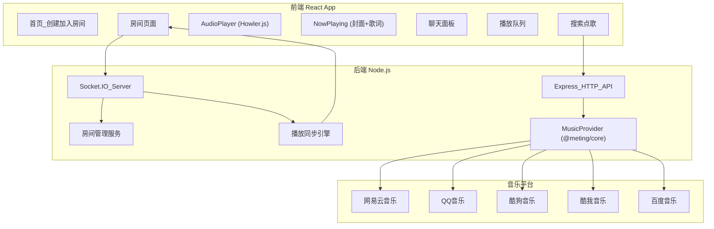
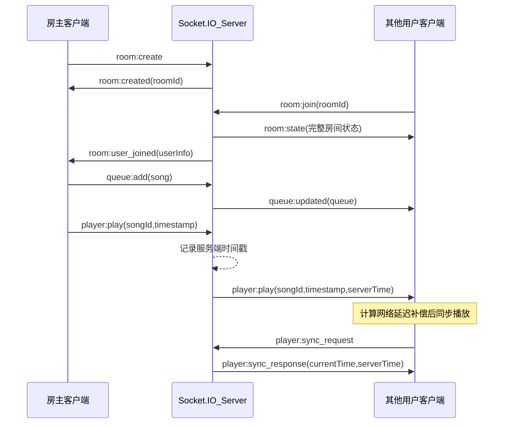
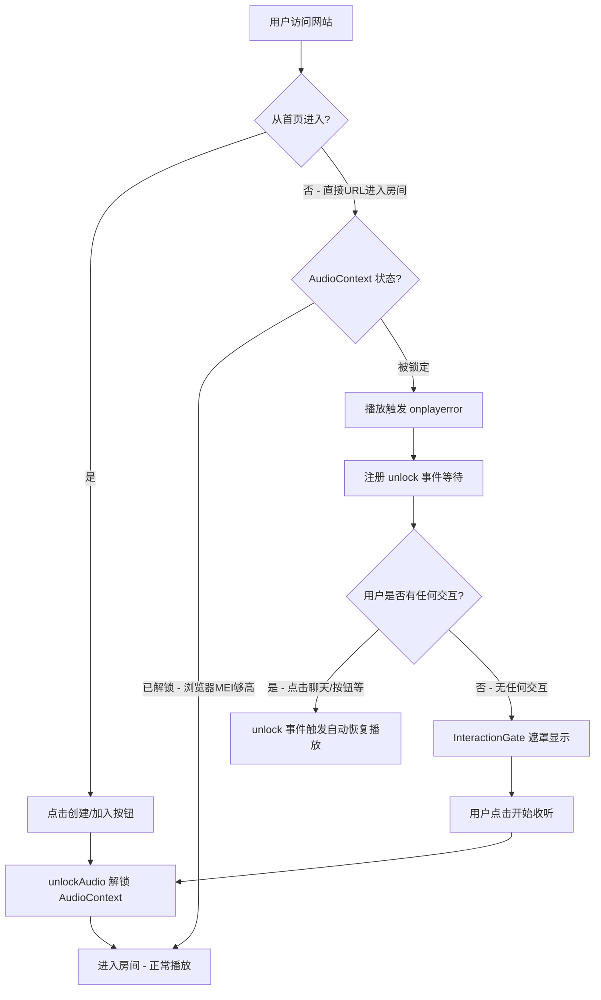

# Music Together - 在线同步听歌平台 技术设计方案

## 一、核心功能（MVP 范围）

- **房间系统**：创建/加入房间（通过房间 ID 或链接），房主权限控制
- **多音源搜索与点歌**：国内 5 大平台（网易云、QQ 音乐、酷狗、酷我、百度），由 `@meting/core` 统一提供
- **纯音频播放**：统一使用 Howler.js 播放音频流，播放器 UI 显示专辑封面 + 歌词 + 控制栏
- **播放列表队列**：添加、移除、排序歌曲
- **同步播放**：房间内所有人听到同一首歌的同一进度
- **实时聊天**：房间内文字聊天
- **权限控制**：房主可设置"仅房主控制"或"所有人可操作"

## 二、推荐技术栈与完整依赖清单

### 包管理与 Monorepo

使用 **pnpm workspaces** 管理 monorepo，所有子包放在 `packages/` 下：

```yaml
# pnpm-workspace.yaml
packages:
  - 'packages/*'
```

根目录 `package.json` 配置公共开发工具（TypeScript、ESLint、Prettier），子包通过 `workspace:*` 协议互相引用。

---

### 前端 (packages/client/) 依赖

#### 核心框架与构建

- **react** + **react-dom** - UI 框架
- **vite** + **@vitejs/plugin-react** - 构建工具（MVP 不需要 SSR，Vite 更轻量）
- **typescript** - 类型安全
- **react-router-dom** - 客户端路由（首页 / 房间页面）

#### UI 与样式

- **tailwindcss** + **@tailwindcss/vite** - 原子化 CSS（Tailwind v4，Vite 插件集成）
- **shadcn/ui** - 高质量可定制 UI 组件库（`npx shadcn@latest init` 安装，按需添加）
  - 需要的组件：`button`, `input`, `card`, `dialog`, `sheet`(Drawer), `tabs`, `scroll-area`, `slider`, `tooltip`, `avatar`, `badge`, `dropdown-menu`
- **lucide-react** - 图标库（shadcn/ui 默认使用）
- **clsx** + **tailwind-merge** - 类名合并工具（shadcn/ui 依赖）
- **class-variance-authority** - 组件变体管理（shadcn/ui 依赖）

#### 实时通信

- **socket.io-client** ^4.8.3 - Socket.IO 客户端

#### 播放器

- **howler** ^2.2.4 - 纯音频播放库（Web Audio API + HTML5 Audio 降级），统一播放所有平台的音频流，提供 `play()` / `pause()` / `seek()` / `playing()` 等控制方法

#### 状态管理

- **zustand** ^5.x - 轻量状态管理（~1kB gzip），集中式 store 模式

#### 工具

- **nanoid** - 生成房间短 ID
- **dayjs** - 轻量时间处理（聊天时间戳等）
- **sonner** - Toast 通知

#### 开发依赖

- **@types/react**, **@types/react-dom**, **@types/node** - 类型声明
- **eslint** + **eslint-plugin-react-hooks** - 代码检查
- **prettier** + **prettier-plugin-tailwindcss** - 代码格式化

---

### 后端 (packages/server/) 依赖

#### 核心框架

- **express** ^4.x - HTTP API 路由（音乐搜索等 REST API）
- **socket.io** ^4.8.3 - WebSocket 实时双向通信（同步与聊天核心）
- **cors** - 跨域配置
- **dotenv** - 环境变量管理

#### TypeScript 支持

- **typescript** + **tsx** - TS 编译运行（`tsx` 替代 `ts-node`，速度更快）
- **@types/express**, **@types/cors** - 类型声明

#### 音乐 API - 核心库

**1. 国内多平台聚合 - `@meting/core**` (核心选型)

- 仓库：[metowolf/Meting](https://github.com/metowolf/Meting)（1940 stars，MIT 许可证）
- npm 包：`@meting/core` v1.6.0（2025.10.24 发布，首发 2025.08.28，近期活跃维护）
- **零外部依赖**，仅 ~20KB
- **统一接口**，一个库支持 5 大平台：
  - `netease` - 网易云音乐
  - `tencent` - QQ 音乐 / 腾讯音乐
  - `kugou` - 酷狗音乐
  - `baidu` - 百度音乐
  - `kuwo` - 酷我音乐
- 所有平台 API 完整支持：search / song / album / artist / playlist / url / lyric / pic
- `format(true)` 返回标准化 JSON，无需额外写适配器

```typescript
import Meting from '@meting/core'

// 搜索 QQ 音乐
const qq = new Meting('tencent')
qq.format(true)
const result = await qq.search('周杰伦', { limit: 20 })
const songs = JSON.parse(result)
// => [{ id, name, artist: [], album, pic_id, url_id, lyric_id, source: "tencent" }]

// 获取播放 URL
const urlInfo = await qq.url(songs[0].url_id, 320)
// => { url: "https://...", size: 12345, br: 320 }

// 切换到网易云
qq.site('netease')
const ncmResult = await qq.search('周杰伦')

// 获取歌单内容
const playlist = await qq.playlist('12345678')

// 获取歌词
const lyric = await qq.lyric(songs[0].lyric_id)

// 获取封面图
const cover = await qq.pic(songs[0].pic_id, 300)
```

**(可选) 网易云用户歌单增强 - `@neteasecloudmusicapienhanced/api**`

- 仓库：[NeteaseCloudMusicApiEnhanced/api-enhanced](https://github.com/NeteaseCloudMusicApiEnhanced/api-enhanced)（506 stars，v4.30.0，2026.02.06 更新）
- Meting 的 `playlist(id)` 需要知道歌单 ID，若需要按用户 ID 获取歌单列表等高级功能，可额外引入此库
- MVP 阶段可不引入，后续有需求再加

#### 工具

- **nanoid** - 生成房间 ID
- **tsx --watch** - 开发热重载

---

### 共享类型 (packages/shared/)

前后端共享的 TypeScript 类型定义和 Socket 事件常量，通过 pnpm `workspace:*` 协议引用：

```json
// packages/client/package.json 和 packages/server/package.json
{
  "dependencies": {
    "@music-together/shared": "workspace:*"
  }
}
```

```typescript
// packages/shared/src/types.ts
export interface Track {
  id: string                                          // 内部唯一 ID
  title: string
  artist: string[]
  album: string
  duration: number
  cover: string                                       // 封面图 URL
  source: 'netease' | 'tencent' | 'kugou' | 'kuwo' | 'baidu'
  sourceId: string                                    // 原平台歌曲 ID
  urlId: string                                       // 用于获取播放 URL 的 ID
  lyricId?: string                                    // 用于获取歌词的 ID
  picId?: string                                      // 用于获取封面的 ID
  streamUrl?: string                                  // 音频流 URL（运行时由后端填充）
}

export interface RoomState {
  id: string
  name: string
  hostId: string
  mode: 'host-only' | 'collaborative'
  users: User[]
  queue: Track[]
  currentTrack: Track | null
  playState: PlayState
}

export interface PlayState {
  isPlaying: boolean
  currentTime: number
  serverTimestamp: number
}

export interface User {
  id: string
  nickname: string
  isHost: boolean
}
```

```typescript
// packages/shared/src/events.ts - Socket.IO 事件类型
export const EVENTS = {
  ROOM_CREATE: 'room:create',
  ROOM_JOIN: 'room:join',
  ROOM_LEAVE: 'room:leave',
  ROOM_STATE: 'room:state',
  ROOM_USER_JOINED: 'room:user_joined',
  ROOM_USER_LEFT: 'room:user_left',
  ROOM_SETTINGS: 'room:settings',
  PLAYER_PLAY: 'player:play',
  PLAYER_PAUSE: 'player:pause',
  PLAYER_SEEK: 'player:seek',
  PLAYER_NEXT: 'player:next',
  PLAYER_SYNC: 'player:sync',
  QUEUE_ADD: 'queue:add',
  QUEUE_REMOVE: 'queue:remove',
  QUEUE_REORDER: 'queue:reorder',
  CHAT_MESSAGE: 'chat:message',
} as const
```

---

### 数据存储策略

- **MVP 阶段**：使用内存 `Map<string, RoomState>` 存储房间状态，无需数据库
- **后续扩展**：
  - **Redis** - 房间状态缓存（支持多实例部署）
  - **PostgreSQL + Prisma** - 用户账号、历史记录、收藏歌单持久化

## 三、项目结构（pnpm Workspaces Monorepo）

```
music-together/
├── packages/
│   ├── client/                        # 前端 React 应用
│   │   ├── src/
│   │   │   ├── components/
│   │   │   │   ├── ui/                # shadcn/ui 组件（自动生成）
│   │   │   │   ├── Player/
│   │   │   │   │   ├── AudioPlayer.tsx       # 核心音频播放器（Howler.js 封装）
│   │   │   │   │   ├── PlayerControls.tsx    # 播放控制栏（进度条、上/下一首、音量）
│   │   │   │   │   ├── NowPlaying.tsx        # 当前播放信息（封面 + 歌名 + 艺术家）
│   │   │   │   │   └── LyricDisplay.tsx      # 歌词显示（滚动歌词）
│   │   │   │   ├── Chat/                     # 右侧聊天 Drawer（默认展开，可折叠）
│   │   │   │   │   ├── ChatDrawer.tsx        # 可折叠聊天面板（展开/收起 + 未读提示）
│   │   │   │   │   └── ChatMessage.tsx       # 单条消息（用户消息/系统通知）
│   │   │   │   ├── Overlays/                 # 弹出层（Drawer / Dialog）
│   │   │   │   │   ├── QueueDrawer.tsx       # 队列 Drawer（播放列表+拖拽排序）
│   │   │   │   │   ├── SearchDialog.tsx      # 搜索 Dialog（音源Tab+搜索+结果）
│   │   │   │   │   ├── SearchResultItem.tsx  # 搜索结果项
│   │   │   │   │   └── SettingsDialog.tsx    # 设置 Dialog（权限/房间信息/用户列表）
│   │   │   │   ├── InteractionGate.tsx          # 音频解锁交互门控（第三层保障）
│   │   │   │   └── Room/
│   │   │   │       └── RoomHeader.tsx        # 顶部栏（房间信息+工具按钮）
│   │   │   ├── hooks/
│   │   │   │   ├── useSocket.ts             # Socket.IO 连接管理
│   │   │   │   ├── usePlayer.ts             # 播放器状态与同步
│   │   │   │   └── useRoom.ts              # 房间状态
│   │   │   ├── stores/
│   │   │   │   ├── roomStore.ts             # Zustand 房间状态
│   │   │   │   ├── playerStore.ts           # Zustand 播放器状态
│   │   │   │   └── chatStore.ts             # Zustand 聊天状态
│   │   │   ├── pages/
│   │   │   │   ├── HomePage.tsx             # 首页：创建/加入房间
│   │   │   │   └── RoomPage.tsx             # 房间页面（主布局）
│   │   │   ├── lib/
│   │   │   │   ├── audioUnlock.ts          # AudioContext 解锁工具（三层策略核心）
│   │   │   │   ├── socket.ts               # Socket.IO 客户端单例
│   │   │   │   └── utils.ts                # 工具函数
│   │   │   ├── App.tsx                      # 路由配置
│   │   │   └── main.tsx                     # 入口
│   │   ├── index.html
│   │   ├── components.json                  # shadcn/ui 配置
│   │   ├── tsconfig.json
│   │   ├── vite.config.ts
│   │   └── package.json                     # name: "@music-together/client"
│   │
│   ├── server/                        # 后端 Node.js 应用
│   │   ├── src/
│   │   │   ├── index.ts                     # 入口：Express + Socket.IO 启动
│   │   │   ├── socket/
│   │   │   │   ├── index.ts                 # Socket.IO 初始化与事件路由
│   │   │   │   ├── roomHandler.ts           # 房间相关事件处理
│   │   │   │   ├── playerHandler.ts         # 播放控制事件处理
│   │   │   │   ├── queueHandler.ts          # 队列事件处理
│   │   │   │   ├── chatHandler.ts           # 聊天事件处理
│   │   │   │   └── syncEngine.ts            # 播放同步引擎（时间戳校准）
│   │   │   ├── routes/
│   │   │   │   └── music.ts                 # REST API：音乐搜索
│   │   │   ├── services/
│   │   │   │   ├── roomManager.ts           # 房间生命周期管理（内存 Map）
│   │   │   │   └── musicProvider.ts         # @meting/core 封装（搜索/URL/歌词/封面）
│   │   │   └── utils/
│   │   │       └── logger.ts                # 日志工具
│   │   ├── tsconfig.json
│   │   └── package.json                     # name: "@music-together/server"
│   │
│   └── shared/                        # 前后端共享类型与常量
│       ├── src/
│       │   ├── types.ts                     # Track, RoomState, PlayState, User
│       │   ├── events.ts                    # Socket.IO 事件常量与类型
│       │   └── index.ts                     # 统一导出
│       ├── tsconfig.json
│       └── package.json                     # name: "@music-together/shared"
│
├── package.json                       # 根 package.json（脚本入口）
├── pnpm-workspace.yaml                # pnpm workspace 配置
├── tsconfig.base.json                 # 基础 TS 配置（子包继承）
├── .gitignore
└── README.md
```

## 四、核心架构图




## 五、实时同步机制设计

这是整个应用的核心难点。

### Socket.IO 事件协议




### 同步策略

1. **播放/暂停/跳转**：房主操作后，服务器广播带时间戳的指令
2. **延迟补偿**：客户端通过多次 ping 计算与服务器的时间偏移量（类似 NTP）
3. **定期校准**：每 10-15 秒客户端主动请求一次同步校准
4. **容错范围**：允许 +/- 1 秒的同步误差，超出则强制跳转

### 关键事件列表

- `room:create` / `room:join` / `room:leave` - 房间生命周期
- `room:state` - 完整房间状态同步（新用户加入时）
- `player:play` / `player:pause` / `player:seek` / `player:next` - 播放控制
- `player:sync` - 播放进度同步校准
- `queue:add` / `queue:remove` / `queue:reorder` - 队列管理
- `chat:message` - 聊天消息
- `room:settings` - 房间设置（权限模式等）

## 六、音乐源与播放设计

纯音乐模式下，架构非常简洁：后端只有一个 `MusicProvider`（@meting/core），前端只有一个 `AudioPlayer`（Howler.js）。

### MusicProvider (`musicProvider.ts`)

基于 `@meting/core` 的统一封装，一个类处理 5 个平台：

```typescript
import Meting from '@meting/core'
import type { Track } from '@music-together/shared'

export type MusicSource = 'netease' | 'tencent' | 'kugou' | 'kuwo' | 'baidu'

class MusicProvider {
  private instances = new Map<MusicSource, Meting>()

  private getInstance(source: MusicSource): Meting {
    if (!this.instances.has(source)) {
      const m = new Meting(source)
      m.format(true)
      this.instances.set(source, m)
    }
    return this.instances.get(source)!
  }

  async search(source: MusicSource, keyword: string, limit = 20): Promise<Track[]> {
    const meting = this.getInstance(source)
    const raw = await meting.search(keyword, { limit })
    const songs = JSON.parse(raw)
    return songs.map(song => this.toTrack(song))
  }

  async getStreamUrl(source: MusicSource, urlId: string, bitrate = 320): Promise<string | null> {
    const meting = this.getInstance(source)
    const raw = await meting.url(urlId, bitrate)
    const data = JSON.parse(raw)
    return data.url || null
  }

  async getPlaylist(source: MusicSource, playlistId: string): Promise<Track[]> {
    const meting = this.getInstance(source)
    const raw = await meting.playlist(playlistId)
    const songs = JSON.parse(raw)
    return songs.map(song => this.toTrack(song))
  }

  async getLyric(source: MusicSource, lyricId: string): Promise<string> {
    const meting = this.getInstance(source)
    const raw = await meting.lyric(lyricId)
    const data = JSON.parse(raw)
    return data.lyric || ''
  }

  async getCover(source: MusicSource, picId: string, size = 300): Promise<string> {
    const meting = this.getInstance(source)
    const raw = await meting.pic(picId, size)
    const data = JSON.parse(raw)
    return data.url || ''
  }

  private toTrack(song: any): Track {
    return {
      id: nanoid(),
      title: song.name,
      artist: song.artist,
      album: song.album,
      duration: 0,
      cover: '',
      source: song.source,
      sourceId: song.id,
      urlId: song.url_id,
      lyricId: song.lyric_id,
      picId: song.pic_id,
    }
  }
}

export const musicProvider = new MusicProvider()
```

### 播放策略（纯音频）

所有平台统一使用 Howler.js 播放：

1. 用户点歌后，后端通过 `musicProvider.getStreamUrl()` 获取音频直链
2. 前端收到 `streamUrl`，使用 Howler.js 创建播放实例：
  ```typescript
   const howl = new Howl({ src: [streamUrl], html5: true, format: ['mp3'] })
  ```
3. `html5: true` 模式避免 CORS 问题，同时支持流式播放（无需完整下载）
4. 同步引擎通过 `howl.seek()` / `howl.play()` / `howl.pause()` / `howl.seek()` 精确控制播放进度

### 播放器 UI 布局

纯音乐模式下，播放器区域显示：

- 专辑封面大图（通过 `musicProvider.getCover()` 获取）
- 歌曲名 + 艺术家名
- 滚动歌词（通过 `musicProvider.getLyric()` 获取，解析 LRC 格式）
- 播放控制栏：上一首 / 播放暂停 / 下一首 / 进度条 / 音量

## 七、前端页面设计

### 首页

- 输入昵称
- "创建房间" 按钮
- "加入房间" + 房间号输入框

### 房间页面布局

设计原则：**大屏充分利用，歌词直接展示，聊天常驻右侧，低频功能弹窗弹出**。

```
+----------------------------------------------------------------------+
| Music Together   ABC123   3人在线              [列表] [搜索] [设置]    |
+----------------------------------------------+-----------------------+
|                                              |                       |
|   ┌────────────┐   Pages turn slow,          | -- C 加入了房间 --     |
|   |            |   seasons we outgrow        |                       |
|   |  专辑封面   |   轻轻翻动书页，时光流转      | 用户A: 这首歌好听！     |
|   |  (大图     |                             | 用户B: +1             |
|   |  圆角阴影)  |   Footsteps echo where     | 用户C: 大家好          |
|   |            |   the petals blow           | 用户A: 下首点周杰伦的   |
|   └────────────┘   花瓣纷飞的地方，回荡着       |                       |
|                    脚步声                     |                       |
|   碎花                                        |                       |
|   飞行雪绒         I paint the sky with       |                       |
|                    yesterday's light         |                       |
|   <<  ||  >>       昨日的光芒描绘天空          |                       |
|   -----o---------- 0:30 / 2:02               |                       |
|                                              | [输入消息...]   [发送]  |
+----------------------------------------------+-----------------------+
```

**主界面两栏布局：**

- **左侧 (~60-65%)**：播放器 + 歌词（常驻展示）
  - 上半部左侧：专辑封面（大图，圆角阴影）
  - 上半部右侧：**滚动歌词**（当前行高亮放大，前后行渐隐，支持原文+翻译双行显示）
  - 下半部：歌名 + 艺术家 + 播放控制栏（上一首/播放暂停/下一首 + 进度条 + 时间）
  - 背景：封面主色调渐变模糊（氛围感，参考网易云全屏播放页风格）
  - 无歌词时，封面居中放大展示
- **右侧 (~35-40%)**：聊天 Drawer（默认展开，可折叠收起到右侧边缘）
  - 消息流（用户消息 + 系统通知：加入/离开/切歌/点歌）
  - 底部输入框 + 发送按钮
  - 顶部有折叠按钮（箭头图标），点击收起到右侧边缘（只留一个小 Tab 按钮可重新展开）
  - 收起后，左侧播放器+歌词自动扩展占满全屏，沉浸感更强
  - 有新消息时，收起状态的小 Tab 上显示未读数量提示

**低频功能按需弹出（顶部工具栏图标按钮触发）：**

- **[列表]** --> 播放队列 Drawer（从右侧滑出，覆盖聊天面板）
  - 当前曲目高亮，可拖拽排序/删除，关闭后回到聊天
- **[搜索]** --> 搜索 Dialog（居中大弹窗）
  - 音源 Tab 切换（网易云/QQ/酷狗/酷我/百度）+ 搜索框 + 结果列表，点击添加到队列
- **[设置]** --> 设置 Dialog
  - 权限模式切换、房间号+复制链接、在线用户列表、音量控制

## 八、MVP 开发步骤

按优先级排序，每一步都应该是可运行的增量：

1. **项目初始化**：创建 pnpm monorepo，初始化前后端项目骨架，配置 TS / Tailwind / Socket.IO
2. **房间系统**：创建房间、加入房间、房间状态管理（Socket.IO rooms）
3. **音乐搜索**：后端 @meting/core 集成，REST API 搜索接口，前端搜索面板（5 平台 Tab 切换）
4. **音频播放器**：Howler.js 封装，播放器 UI（封面 + 控制栏），后端获取音频流 URL
5. **播放同步引擎**：房间内播放/暂停/跳转同步，时间戳校准
6. **播放队列**：添加/移除/排序歌曲，自动播放下一首
7. **歌词显示**：后端获取 LRC 歌词，前端解析并滚动显示
8. **实时聊天**：房间内文字聊天
9. **权限控制**：房主模式 vs 协作模式切换
10. **UI 美化**：响应式布局、动画、暗色主题

## 九、浏览器音频自动播放解锁策略

现代浏览器（Chrome 66+、Safari、Firefox）强制执行 Autoplay Policy：未经用户真实交互（trusted event），不允许播放有声音频。`**element.click()` / `dispatchEvent` 等代码模拟交互无法绕过**，浏览器内核区分 trusted / untrusted events。

本项目采用**三层防御策略**，确保在各种进入房间的路径下都能正常播放：

### 第一层：提前解锁 AudioContext（核心策略）

利用用户**加入/创建房间的按钮点击**（天然的 trusted event），在导航到房间页面之前提前解锁全局 AudioContext：

```typescript
// packages/client/src/lib/audioUnlock.ts

import { Howl, Howler } from 'howler'

let unlocked = false

export function isAudioUnlocked(): boolean {
  return unlocked
}

/**
 * 在真实用户交互（click / keydown）中调用
 * 解锁 Howler 全局 AudioContext，之后所有播放无需再等交互
 */
export async function unlockAudio(): Promise<void> {
  if (unlocked) return

  // 1. 恢复 Howler 的全局 AudioContext
  const ctx = Howler.ctx
  if (ctx && ctx.state === 'suspended') {
    await ctx.resume()
  }

  // 2. 播放一段静音 WAV，强制激活（兼容 iOS Safari）
  const silentHowl = new Howl({
    src: [
      'data:audio/wav;base64,UklGRiQAAABXQVZFZm10IBAAAAABAAEAQB8AAIA+AAACABAAZGF0YQAAAAA=',
    ],
    volume: 0,
    html5: true,
  })
  silentHowl.play()
  silentHowl.once('end', () => silentHowl.unload())

  unlocked = true
}
```

**调用时机**：`HomePage.tsx` 中"创建房间"和"加入房间"按钮的 `onClick` 处理函数内调用 `unlockAudio()`，然后再执行路由跳转。

### 第二层：Howler.js onplayerror + unlock 自动重试（兜底）

在 `AudioPlayer.tsx` 封装 Howl 实例时，利用 Howler.js 内置的 `onplayerror` 和 `unlock` 事件实现静默重试：

```typescript
// AudioPlayer.tsx 中创建 Howl 实例
const howl = new Howl({
  src: [streamUrl],
  html5: true,
  format: ['mp3'],
  onplay: () => {
    // 播放成功
  },
  onplayerror: function () {
    // 播放被浏览器策略阻止
    // 注册 unlock 事件：用户下一次任意交互时自动恢复播放
    howl.once('unlock', () => {
      howl.play()
    })
  },
})
```

**原理**：Howler.js 的 `autoUnlock` 默认开启，会在全局监听 `click` / `touchend` 等事件。当检测到真实交互后触发 `unlock` 事件，此时 `onplayerror` 注册的回调自动执行 `play()` 恢复播放。

### 第三层：交互门控 UI - InteractionGate 组件（极端保障）

当用户通过 URL 直接进入房间页（跳过首页），且从未有过任何页面交互时的最终保障：

```typescript
// packages/client/src/components/InteractionGate.tsx

import { isAudioUnlocked, unlockAudio } from '@/lib/audioUnlock'
import { Button } from '@/components/ui/button'
import { Card } from '@/components/ui/card'
import { Play } from 'lucide-react'
import { useState } from 'react'

export function InteractionGate({ children }: { children: React.ReactNode }) {
  const [gateOpen, setGateOpen] = useState(() => isAudioUnlocked())

  if (gateOpen) return <>{children}</>

  return (
    <div className="fixed inset-0 z-50 flex items-center justify-center bg-background/80 backdrop-blur-sm">
      <Card className="flex flex-col items-center gap-4 p-8">
        <Play className="h-12 w-12 text-primary" />
        <h2 className="text-xl font-semibold">准备就绪</h2>
        <p className="text-muted-foreground">点击开始，与房间好友一起听歌</p>
        <Button
          size="lg"
          onClick={async () => {
            await unlockAudio()
            setGateOpen(true)
          }}
        >
          开始收听
        </Button>
      </Card>
    </div>
  )
}
```

**使用方式**：在 `RoomPage.tsx` 中包裹房间内容：

```tsx
// pages/RoomPage.tsx
export default function RoomPage() {
  return (
    <InteractionGate>
      {/* 房间主界面内容 */}
    </InteractionGate>
  )
}
```

### 三层协作流程




> **补充说明**：Chrome 的 Media Engagement Index (MEI) 机制会记录用户在各站点的媒体交互历史，高 MEI 的站点可直接自动播放。随着用户频繁使用本应用，浏览器会自动提高 MEI 权重，逐渐放宽自动播放限制。

## 十、注意事项与风险

- **版权风险**：Meting 等非官方 API 可能随时失效，仅供个人学习使用，不建议公开商用部署
- **CORS 问题**：音乐搜索必须通过后端代理。Howler.js 播放音频流时需设置 `html5: true` 以 HTML5 Audio 模式播放，避免 CORS 限制
- **浏览器自动播放策略**：已设计三层防御策略（详见第九章）：① 加入房间时提前解锁 AudioContext ② Howler.js `onplayerror` + `unlock` 事件自动重试 ③ `InteractionGate` 交互门控组件兜底
- **VIP 歌曲限制**：部分平台 VIP 歌曲无法获取播放 URL，`musicProvider.getStreamUrl()` 返回 null 时自动跳过并播放下一首
- **Meting 平台差异**：不同平台数据完整度可能不同（如时长、封面），需做降级处理（缺少封面时用默认图）
- **音频流 URL 有效期**：部分平台返回的音频 URL 有时效限制，播放前需重新获取
- **后续扩展**：如需视频播放，可加入 YouTube IFrame API / B站播放器；如需持久化，可引入 PostgreSQL + Prisma

## 十一、依赖总览速查表

### packages/client/package.json

```
name: "@music-together/client"

dependencies:
  @music-together/shared               # workspace:* 共享类型
  react, react-dom, react-router-dom   # 核心框架
  socket.io-client                      # 实时通信
  howler                                # 纯音频播放（唯一播放引擎）
  zustand                               # 状态管理
  nanoid, dayjs                         # 工具库
  sonner                                # Toast 通知
  lucide-react                          # 图标
  clsx, tailwind-merge                  # shadcn/ui 依赖
  class-variance-authority              # shadcn/ui 依赖

devDependencies:
  vite, @vitejs/plugin-react            # 构建
  typescript, @types/react, @types/node # TS
  tailwindcss, @tailwindcss/vite        # 样式
  eslint, prettier                      # 代码质量
```

### packages/server/package.json

```
name: "@music-together/server"

dependencies:
  @music-together/shared               # workspace:* 共享类型
  express, cors, dotenv                 # HTTP 服务
  socket.io                             # WebSocket
  @meting/core                          # 国内 5 大平台音乐 API（唯一音乐源）
  nanoid                                # ID 生成

devDependencies:
  typescript, tsx                        # TS 编译运行
  @types/express, @types/cors           # 类型声明
```

### packages/shared/package.json

```
name: "@music-together/shared"

dependencies: (无)

devDependencies:
  typescript                             # TS 编译
```

### 根 package.json

```
name: "music-together"
private: true

scripts:
  dev: "pnpm -r --parallel run dev"     # 同时启动前后端
  dev:client: "pnpm --filter @music-together/client dev"
  dev:server: "pnpm --filter @music-together/server dev"
  build: "pnpm -r run build"

devDependencies:
  typescript                             # 根级 TS（可选，供 IDE 使用）
```

