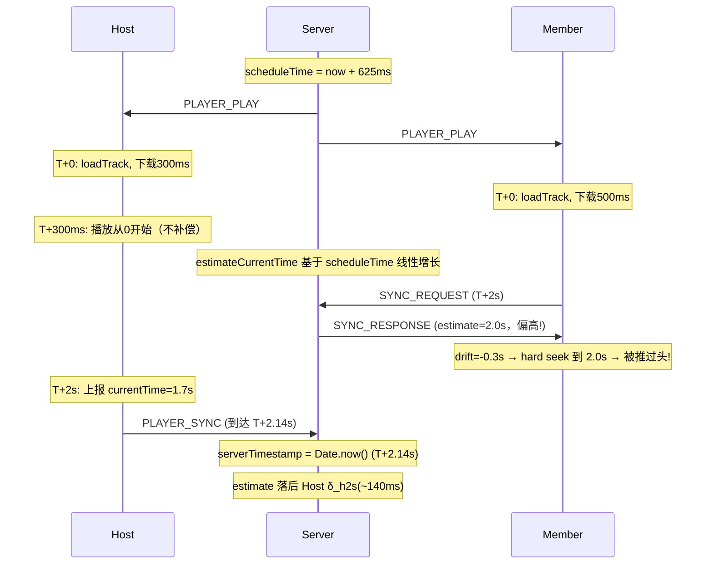
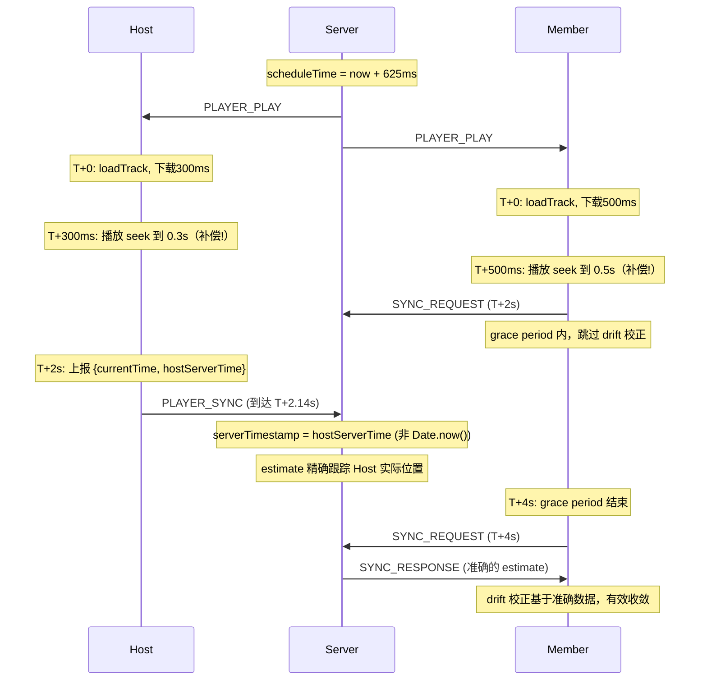

# 修复播放同步偏差

## 问题根因回顾

**问题 1（偏移卡住 500-600ms）**：新曲加载时 `serverTimestamp = scheduleTime`（未来时间点），但音频下载需要几百毫秒。在 Host 第一次上报前（约 2s），`estimateCurrentTime` 偏高。drift 校正在此期间用错误的 expected 做 hard seek，把 Member 推到错误位置。后续修正靠 rate 调整收敛太慢（MAX_RATE_ADJUSTMENT=0.01, 每秒 10ms），形成反复 hard seek 循环。

**问题 2（偏移值低但听感延迟）**：Host `PLAYER_SYNC` 上报的 `currentTime` 是 Host 发出时的位置，但服务端用 `Date.now()` 作为 `serverTimestamp`——中间差了 Host-to-Server 单向延迟（约 RTT/2）。`estimateCurrentTime` 系统性落后 Host 实际位置 ~RTT/2。drift 校正把 Member 拉到 expected 附近（drift 约 0），但 expected 本身就落后 Host。

## 修复方案（3 项变更）

### 变更 1：Host 上报附带 NTP 校准时间戳（修复问题 2）

Host 已通过 NTP 校准获得准确的服务器时间估值。上报时附带 `getServerTime()`，服务端用它替代 `Date.now()` 作为 `serverTimestamp`，消除 Host-to-Server 网络延迟导致的系统性偏差。

涉及文件：

- [packages/shared/src/schemas.ts](packages/shared/src/schemas.ts) — `playerSyncSchema` 添加可选字段 `hostServerTime`：

```typescript
export const playerSyncSchema = z.object({
  currentTime: z.number().finite().nonnegative(),
  hostServerTime: z.number().finite().positive().optional(),
})
```

- [packages/shared/src/socket-types.ts](packages/shared/src/socket-types.ts) — `PLAYER_SYNC` 事件类型添加 `hostServerTime`：

```typescript
[EVENTS.PLAYER_SYNC]: (data: { currentTime: number; hostServerTime?: number }) => void
```

- [packages/client/src/hooks/usePlayerSync.ts](packages/client/src/hooks/usePlayerSync.ts) — Host report 附带 `getServerTime()`：

```typescript
socket.emit(EVENTS.PLAYER_SYNC, {
  currentTime: howlRef.current.seek() as number,
  hostServerTime: getServerTime(),
})
```

两处 `socket.emit(EVENTS.PLAYER_SYNC, ...)` 都要改（report 函数内 + visibilitychange handler 内）。

- [packages/server/src/controllers/playerController.ts](packages/server/src/controllers/playerController.ts) — 使用 `hostServerTime` 替代 `Date.now()`。增加合理性校验（与 `Date.now()` 偏差不超过 10s，防止客户端篡改）：

```typescript
const serverNow = Date.now()
const timestamp = (
  parsed.data.hostServerTime &&
  Math.abs(parsed.data.hostServerTime - serverNow) < 10_000
) ? parsed.data.hostServerTime : serverNow

room.playState = { ...room.playState, currentTime, serverTimestamp: timestamp }
```

### 变更 2：新曲加载后 drift 校正 grace period（修复问题 1）

在 `onPlay`（新曲事件）后的 grace period 内跳过 drift 校正，等待 Host 至少完成一次上报（覆盖掉 scheduleTime 作为 serverTimestamp 的偏高 estimate）。

涉及文件：

- [packages/client/src/lib/constants.ts](packages/client/src/lib/constants.ts) — 新增常量：

```typescript
/** Grace period (ms) after new track before drift correction activates.
 *  Allows at least one host report to correct estimateCurrentTime. */
export const DRIFT_GRACE_PERIOD_MS = 4_000
```

- [packages/client/src/hooks/usePlayerSync.ts](packages/client/src/hooks/usePlayerSync.ts) — 在 `onSyncResponse` 开头增加 grace period 检查：

```typescript
// Skip drift correction during grace period after new track —
// estimateCurrentTime is based on scheduleTime and is unreliable
// until the host submits at least one progress report.
if (Date.now() - trackStartTimeRef.current < DRIFT_GRACE_PERIOD_MS) return
```

`trackStartTimeRef` 已在 `onPlay` 中被设为 `Date.now()`，无需额外改动。

### 变更 3：降低加载补偿阈值（辅助修复问题 1）

当前 `LOAD_COMPENSATION_THRESHOLD_S = 0.5`，新曲 `seekTo=0` 时加载耗时 < 0.5s 不补偿。在高延迟场景下 200-400ms 的加载延迟不被补偿，导致实际播放位置偏离 estimateCurrentTime。降低阈值让更多情况触发补偿，减少初始偏差。

涉及文件：

- [packages/client/src/lib/constants.ts](packages/client/src/lib/constants.ts) — 降低阈值：

```typescript
export const LOAD_COMPENSATION_THRESHOLD_S = 0.15
```

此改动同时影响 Host 和 Member，所有客户端的加载延迟 > 150ms 都会补偿 seek，缩小各客户端之间的初始位置差异。

### 变更 4：修复加入房间时 CHAT_HISTORY 丢失的竞态

服务端 `ROOM_JOIN` handler 连续发送 `ROOM_STATE` + `CHAT_HISTORY`。`HomePage` 监听 `ROOM_STATE` 后立即 `navigate()` 到 `RoomPage`，但 `CHAT_HISTORY` 的监听器在 `useChatSync`（`RoomPage` 内），此时 `RoomPage` 尚未挂载，事件被丢弃。

修复：在 `HomePage` 中也监听 `CHAT_HISTORY`，在导航前将消息存入 `chatStore`。

涉及文件：

- [packages/client/src/pages/HomePage.tsx](packages/client/src/pages/HomePage.tsx) — 在 `useEffect` 中添加 `CHAT_HISTORY` 监听：

```typescript
import { useChatStore } from '@/stores/chatStore'
import type { ChatMessage } from '@music-together/shared'

// Inside the useEffect that listens for ROOM_STATE:
const onChatHistory = (messages: ChatMessage[]) => {
  useChatStore.getState().setMessages(messages)
}

socket.on(EVENTS.CHAT_HISTORY, onChatHistory)

// cleanup:
socket.off(EVENTS.CHAT_HISTORY, onChatHistory)
```

当 `RoomPage` 挂载后，`useChatSync` 再次注册同一事件的监听器。由于 `CHAT_HISTORY` 已经在 `HomePage` 中被存入 store，`RoomPage` 中的 `ChatPanel` 直接从 store 读取到数据即可。后续新消息通过 `CHAT_MESSAGE` 事件正常接收。

### 变更 5：同步更新架构文档

- [docs/PROJECT_ARCHITECTURE.md](docs/PROJECT_ARCHITECTURE.md) — 更新以下章节：
  - "Host 上报与服务端状态维护" 章节，说明 Host 上报附带 `hostServerTime` 消除网络延迟偏差
  - "周期性比例漂移校正" 章节，说明新曲加载后的 grace period 机制
  - "其他同步机制" 或相关章节，说明 `CHAT_HISTORY` 竞态修复

## 修复后的同步时序（对比）

修复前：




修复后：




