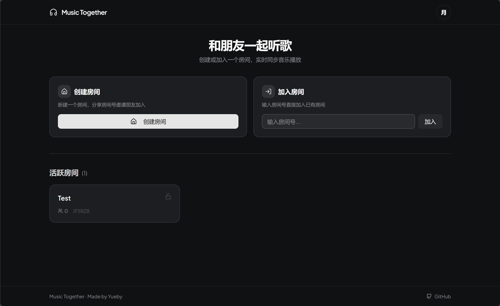
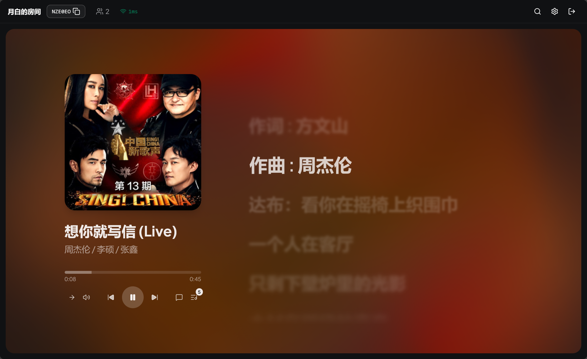
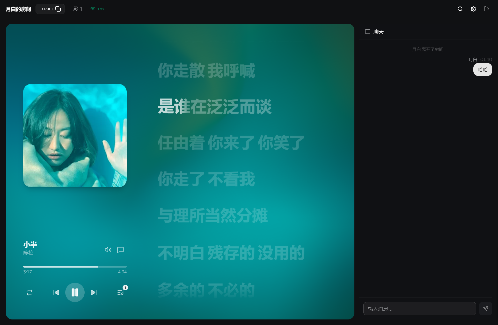
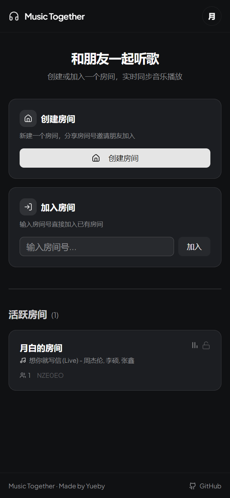
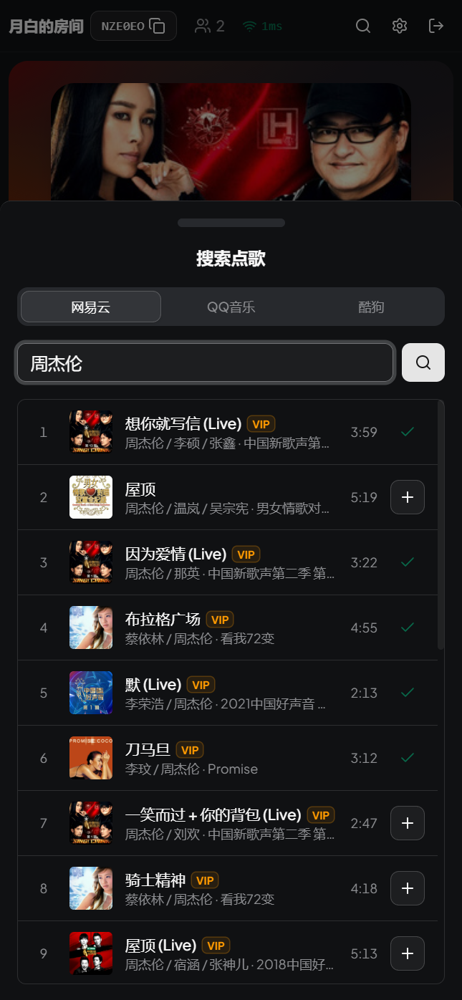
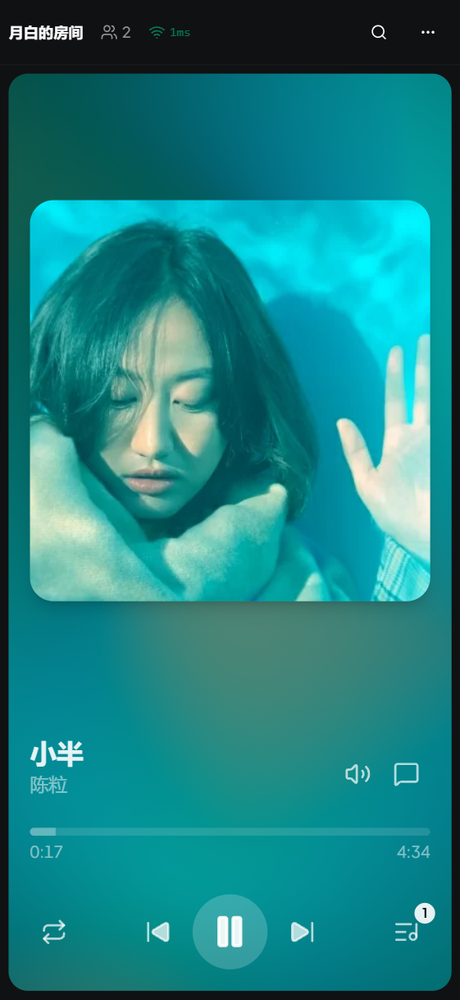
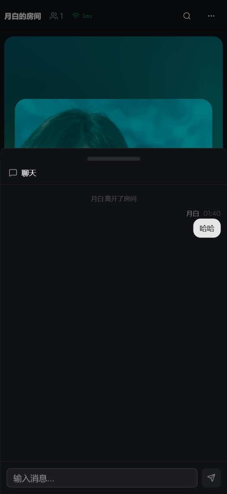

<p align="center">
  <picture>
    <source media="(prefers-color-scheme: dark)" srcset="public/logo-light.svg">
    <source media="(prefers-color-scheme: light)" srcset="public/logo-dark.svg">
    
  </picture>
</p>

<h1 align="center">Music Together</h1>

<p align="center">
  A real-time collaborative music listening platform — create a room, invite friends, and listen to the same song perfectly synchronized.
</p>

<p align="center">
  <a href="README.md">简体中文</a>
</p>

<p align="center">
  <a href="https://github.com/Yueby/music-together/stargazers"></a>
  <a href="https://github.com/Yueby/music-together/network/members"></a>
  <a href="https://github.com/Yueby/music-together/issues"></a>
  <a href="LICENSE"></a>
</p>

<p align="center">
  
  
  
  
  
  
</p>

## Screenshots

### Desktop

| Home | Search | Player | Chat |
|:---:|:---:|:---:|:---:|
|  |  |  |  |

### Mobile

| Home | Search | Player | Chat |
|:---:|:---:|:---:|:---:|
|  |  |  |  |

## Features

- **Real-time sync** -- NTP clock synchronization + scheduled execution for minimal latency
- **Multi-platform music sources** -- NetEase Cloud Music, QQ Music
- **Apple Music-style lyrics** -- Word-by-word animated lyrics, responsive on desktop and mobile
- **VIP song support** -- Room-scoped cookie pool via NetEase QR login
- **RBAC permissions** -- Host > Admin > Member with fine-grained access control
- **Voting system** -- Members vote to control playback actions
- **Play modes** -- Sequential, single loop, list loop, shuffle
- **Real-time chat** -- In-room text messaging with system messages
- **Role grace period** -- Privileged users retain roles for 30s after disconnect
- **Mobile responsive** -- Adaptive layout with orientation-based switching

## Quick Start

### Prerequisites

- Node.js >= 22
- pnpm >= 10

### Install & Develop

```bash
git clone https://github.com/Yueby/music-together.git
cd music-together
pnpm install
pnpm dev
```

Frontend: http://localhost:5173 | Backend: http://localhost:3001

## Deploy

Zero-config Docker single-image deployment:

```bash
docker run -d --name music-together --restart unless-stopped \
  -p 80:3001 ghcr.io/Yueby/music-together:latest
```

Push to main triggers GitHub Actions to build and push the image. See [Architecture Docs](docs/PROJECT_ARCHITECTURE.md) for details.

## Project Structure

```
packages/
  client/   -- Frontend React application
  server/   -- Backend Node.js service
  shared/   -- Shared types, constants, and permission definitions
```

## Acknowledgements

| Library | Description |
|---|---|
| [Howler.js](https://github.com/goldfire/howler.js) | Web audio playback |
| [Apple Music-like Lyrics](https://github.com/Steve-xmh/applemusic-like-lyrics) | Lyrics component (GPL-3.0) |
| [Meting](https://github.com/metowolf/Meting) | Multi-platform music API |
| [NeteaseCloudMusicApi Enhanced](https://github.com/NeteaseCloudMusicApiEnhanced/api-enhanced) | NetEase Cloud Music API |
| [CASL](https://github.com/stalniy/casl) | Permission management |
| [Zustand](https://github.com/pmndrs/zustand) | State management |
| [shadcn/ui](https://github.com/shadcn-ui/ui) | UI component library |
| [Motion](https://github.com/motiondivision/motion) | Animation library |

## License

[AGPL-3.0](LICENSE)
