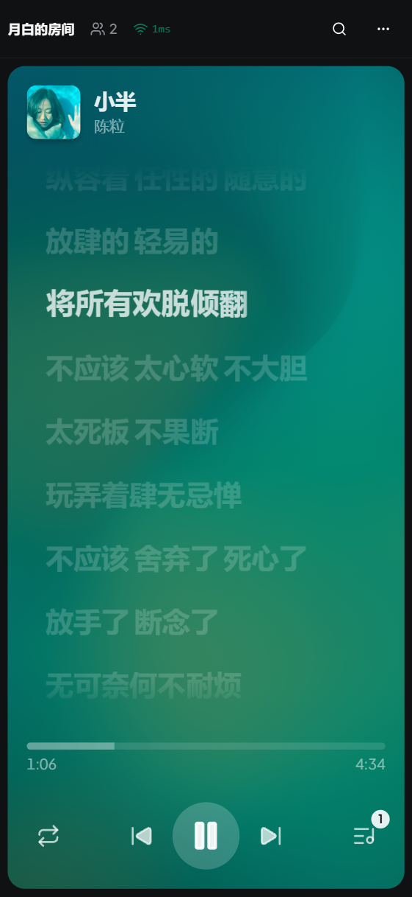

<p align="center">
  
</p>

<h1 align="center">Music Together</h1>

<p align="center">
  在线多人同步听歌平台 -- 创建房间，邀请朋友，一起实时听同一首歌。
</p>

<p align="center">
  <a href="README.en.md">English</a>
</p>

<p align="center">
  <a href="https://github.com/Yueby/music-together/stargazers"></a>
  <a href="https://github.com/Yueby/music-together/network/members"></a>
  <a href="https://github.com/Yueby/music-together/issues"></a>
  <a href="LICENSE"></a>
</p>

<p align="center">
  
  
  
  
  
  
</p>

## 截图

### 桌面端

| 首页 | 搜索 | 播放 | 聊天 |
|:---:|:---:|:---:|:---:|
|  |  |  |  |

### 移动端

| 首页 | 搜索 | 播放 | 聊天 |
|:---:|:---:|:---:|:---:|
|  |  |  |  |

### 歌词展示对比

| 桌面端歌词 | 竖屏默认（封面） | 竖屏歌词模式 |
|:---:|:---:|:---:|
|  |  |  |

## 功能特性

- **实时同步播放** -- 基于 NTP 时钟同步 + 定时执行，延迟极低
- **多平台音源** -- 支持网易云音乐、QQ 音乐搜索与播放
- **Apple Music 风格歌词** -- 逐词高亮动画歌词，桌面端/移动端自适应
- **VIP 歌曲支持** -- 网易云 QR 登录贡献 Cookie，解锁 VIP 曲目（房间级作用域）
- **权限管理 (RBAC)** -- 房主 > 管理员 > 普通成员，细粒度权限控制
- **投票系统** -- 普通成员通过投票控制切歌、暂停等操作
- **播放模式** -- 顺序播放、单曲循环、列表循环、随机播放
- **实时聊天** -- 房间内文字聊天，支持系统消息
- **角色宽限期** -- 特权用户断线后保留角色 30 秒，重连自动恢复
- **移动端适配** -- 响应式设计，横竖屏自动切换布局

## 快速开始

### 环境要求

- Node.js >= 22
- pnpm >= 10

### 安装与开发

```bash
git clone https://github.com/Yueby/music-together.git
cd music-together
pnpm install
pnpm dev
```

前端: http://localhost:5173 | 后端: http://localhost:3001

## 部署

Docker 单镜像零配置部署：

```bash
docker run -d --name music-together --restart unless-stopped \
  -p 80:3001 ghcr.io/Yueby/music-together:latest
```

push 到 main 后 GitHub Actions 自动构建镜像。详见 [架构文档](docs/PROJECT_ARCHITECTURE.md)。

## 项目结构

```
packages/
  client/   -- 前端 React 应用
  server/   -- 后端 Node.js 服务
  shared/   -- 共享类型、常量与权限定义
```

## 致谢

| 库 | 说明 |
|---|---|
| [Howler.js](https://github.com/goldfire/howler.js) | Web 音频播放 |
| [Apple Music-like Lyrics](https://github.com/Steve-xmh/applemusic-like-lyrics) | 歌词组件 (GPL-3.0) |
| [Meting](https://github.com/metowolf/Meting) | 多平台音乐 API |
| [NeteaseCloudMusicApi Enhanced](https://github.com/NeteaseCloudMusicApiEnhanced/api-enhanced) | 网易云音乐 API |
| [CASL](https://github.com/stalniy/casl) | 权限管理 |
| [Zustand](https://github.com/pmndrs/zustand) | 状态管理 |
| [shadcn/ui](https://github.com/shadcn-ui/ui) | UI 组件库 |
| [Motion](https://github.com/motiondivision/motion) | 动画库 |

## 协议

[AGPL-3.0](LICENSE)
