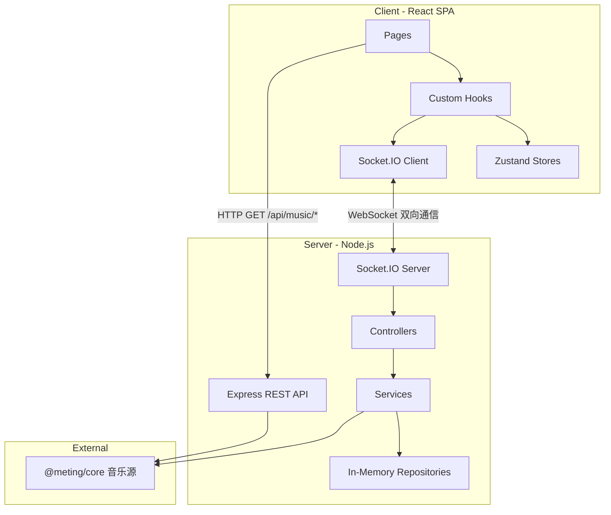

# Music Together — 项目速查手册

> 供 AI 助手快速理解项目全貌的参考文档。

## 1. 项目概览

**Music Together** 是一个在线同步听歌平台，允许多人在同一房间内实时同步播放音乐、聊天互动。

### 核心功能

| 功能 | 说明 |
|------|------|
| 房间系统 | 创建/加入房间，房间号邀请，可选密码保护 |
| 多音源搜索 | 网易云、QQ音乐、酷狗 |
| 同步播放 | 房间内播放进度实时同步 |
| 实时聊天 | 房间内文字聊天 |
| 权限控制 | RBAC 三级权限（host > admin > member）基于 @casl/ability |
| 播放模式 | 顺序播放、列表循环、单曲循环、随机播放（Host/Admin 直接切换，Member 投票切换） |
| 投票系统 | 普通成员通过投票控制播放（暂停/恢复/切歌/切换播放模式） |
| VIP 认证 | 平台账号登录（网易云/QQ/酷狗），房间级 Cookie 池 |
| 歌词展示 | Apple Music 风格歌词动画 (AMLL) |

### 技术栈

- **前端**: React 19 + Vite 7 + TypeScript 5.9 + Tailwind CSS v4 + shadcn/ui + Zustand
- **后端**: Node.js + Express 4 + Socket.IO 4 + @meting/core
- **Monorepo**: pnpm workspaces（3 个包：`client`、`server`、`shared`）

---

## 2. 目录结构

### 根目录

```
music-together/
├── packages/
│   ├── client/          # React 前端
│   ├── server/          # Node.js 后端
│   └── shared/          # 共享类型与常量
├── docs/                # 项目文档（含本文件 PROJECT_ARCHITECTURE.md）
├── .cursor/skills/      # Cursor IDE 技能配置
├── .agents/             # AI Agent 配置
├── package.json         # 根 package（工作区编排）
├── pnpm-workspace.yaml  # pnpm 工作区定义
├── pnpm-lock.yaml
├── README.md
├── .env.example         # 环境变量示例
├── .gitignore
└── .gitattributes
```

### packages/client/src/ — 前端源码

```
src/
├── main.tsx                    # 入口：ReactDOM.createRoot
├── App.tsx                     # 根组件：Router + Provider + ErrorBoundary + Suspense 懒加载
├── index.css                   # 全局样式：Tailwind + 配色变量 + 自定义动画
│
├── pages/                      # 页面级组件
│   ├── HomePage.tsx            #   大厅：创建/加入房间、房间列表
│   ├── RoomPage.tsx            #   房间：播放器 + 聊天（桌面侧栏/移动端 Drawer） + 覆盖层弹窗
│   └── NotFoundPage.tsx        #   404 页面
│
├── components/                 # UI 组件
│   ├── Chat/
│   │   ├── ChatMessage.tsx     #     单条消息（用户/系统）
│   │   └── ChatPanel.tsx       #     聊天面板（消息列表 + 输入框）
│   ├── Lobby/
│   │   ├── CreateRoomDialog.tsx #    创建房间弹窗
│   │   ├── NicknameDialog.tsx  #     设置昵称弹窗
│   │   ├── PasswordDialog.tsx  #     输入房间密码弹窗
│   │   ├── RoomCard.tsx        #     房间列表卡片
│   │   ├── UserPopover.tsx     #     用户信息气泡
│   │   ├── HeroSection.tsx     #     首页 Hero 标题区域
│   │   ├── ActionCards.tsx     #     创建/加入房间卡片
│   │   └── RoomListSection.tsx #     活跃房间列表区域
│   ├── Overlays/
│   │   ├── QueueDrawer.tsx     #     播放队列抽屉（vaul Drawer，移动端底部/桌面端右侧）
│   │   ├── SearchDialog.tsx    #     音乐搜索弹窗（AbortController 竞态防护 + 共享 fetchPage）
│   │   ├── Search/
│   │   │   └── SearchResultItem.tsx # 搜索结果单项
│   │   ├── SettingsDialog.tsx  #     设置弹窗（壳，Tab 导航：房间/成员/账号/个人/外观）
│   │   └── Settings/
│   │       ├── SettingRow.tsx              # 设置行共享组件
│   │       ├── RoomSettingsSection.tsx     # 房间设置（名称、密码）
│   │       ├── MembersSection.tsx          # 成员列表（角色管理）
│   │       ├── PlatformAuthSection.tsx     # 平台账号认证（VIP Cookie）
│   │       ├── ProfileSettingsSection.tsx  # 个人设置（昵称）
│   │       ├── AppearanceSection.tsx       # 外观设置（歌词 + 背景 + 布局）
│   │       ├── ManualCookieDialog.tsx      # 手动输入 Cookie 弹窗
│   │       └── NeteaseQrDialog.tsx         # 网易云 QR 扫码登录弹窗
│   ├── Player/
│   │   ├── AudioPlayer.tsx     #     主播放器布局（封面+控件+歌词）
│   │   ├── LyricDisplay.tsx    #     AMLL 歌词渲染（LRC 正则支持 [mm:ss] / [mm:ss.x] / [mm:ss.xx] / [mm:ss.xxx]）
│   │   ├── NowPlaying.tsx      #     当前曲目信息展示
│   │   └── PlayerControls.tsx  #     进度条+播放控制+音量+播放模式切换
│   ├── Room/
│   │   └── RoomHeader.tsx      #     房间头部（房间名/人数/连接状态/操作按钮）
│   ├── Vote/
│   │   └── VoteBanner.tsx      #     投票横幅（进行中的投票显示 + 投票按钮）
│   ├── InteractionGate.tsx     #   浏览器交互解锁（点击后才能播放音频）
│   └── ui/                     #   shadcn/ui 基础组件
│       ├── avatar.tsx
│       ├── badge.tsx
│       ├── button.tsx
│       ├── card.tsx
│       ├── dialog.tsx
│       ├── drawer.tsx
│       ├── dropdown-menu.tsx
│       ├── input.tsx
│       ├── label.tsx
│       ├── popover.tsx
│       ├── resize-handle.tsx
│       ├── scroll-area.tsx
│       ├── select.tsx
│       ├── separator.tsx
│       ├── responsive-dialog.tsx
│       ├── sheet.tsx
│       ├── skeleton.tsx
│       ├── slider.tsx
│       ├── switch.tsx
│       ├── tabs.tsx
│       └── tooltip.tsx
│
├── hooks/                      # 自定义 Hooks
│   ├── useSocketEvent.ts       #   通用 Socket 事件订阅工具 Hook（自动 on/off，ref 稳定）
│   ├── usePlayer.ts            #   播放器主 hook（组合 useHowl + useLyric + usePlayerSync）
│   ├── useHowl.ts              #   Howler.js 音频实例管理
│   ├── useLyric.ts             #   歌词加载与解析
│   ├── usePlayerSync.ts        #   播放同步（Scheduled Execution + Host 上报 + 周期性漂移校正）
│   ├── useClockSync.ts         #   NTP 时钟同步 hook（校准客户端时钟与服务器对齐）
│   ├── useRoom.ts              #   房间组合 hook（编排 5 个子 hook，对外 API 不变）
│   ├── room/                   #   useRoom 子 hook（按职责拆分）
│   │   ├── useRoomState.ts     #     ROOM_STATE / JOIN / LEFT / SETTINGS / ROLE_CHANGED / ERROR
│   │   ├── useChatSync.ts      #     CHAT_HISTORY / CHAT_MESSAGE
│   │   ├── useQueueSync.ts     #     QUEUE_UPDATED
│   │   ├── useAuthSync.ts      #     AUTH_SET_COOKIE_RESULT + localStorage 持久化
│   │   └── useConnectionGuard.ts #   disconnect → resetAllRoomState
│   ├── useAuth.ts              #   平台认证 UI & Socket 事件
│   ├── useVote.ts              #   投票（使用 useSocketEvent）
│   ├── useChat.ts              #   聊天消息收发
│   ├── useLobby.ts             #   大厅房间列表与操作（使用 useSocketEvent）
│   ├── useQueue.ts             #   播放队列操作
│   └── useIsMobile.ts          #   视口宽度检测（匹配 Tailwind sm: 断点）
│
├── stores/                     # Zustand 状态仓库
│   ├── playerStore.ts          #   播放状态（currentTrack, isPlaying, volume 等）
│   ├── roomStore.ts            #   房间状态（room, currentUser, users）
│   ├── chatStore.ts            #   聊天（messages, unreadCount, isChatOpen）
│   ├── lobbyStore.ts           #   大厅（rooms 列表, isLoading）
│   └── settingsStore.ts        #   设置（移动端布局、歌词参数、背景参数，持久化到 localStorage）
│
├── providers/                  # React Context Provider
│   ├── SocketProvider.tsx      #   Socket.IO 连接管理，提供 socket + isConnected + 断线/重连 Toast
│   └── AbilityProvider.tsx     #   CASL 权限上下文（基于 currentUser.role）
│
└── lib/                        # 工具库
    ├── config.ts               #   配置常量（SERVER_URL）
    ├── constants.ts            #   命名常量（定时器、阈值、布局尺寸）
    ├── clockSync.ts            #   NTP 时钟同步引擎（采样、offset 计算、getServerTime）
    ├── resetStores.ts          #   全局 store 重置工具
    ├── socket.ts               #   Socket.IO 客户端实例
    ├── storage.ts              #   localStorage 封装（带类型校验）
    ├── format.ts               #   格式化工具（时间、文本等）
    ├── audioUnlock.ts          #   浏览器音频自动播放解锁
    └── utils.ts                #   cn() 等通用工具
```

### packages/server/src/ — 后端源码

```
src/
├── index.ts                    # 入口：Express + HTTP + Socket.IO 服务启动与优雅关闭
├── config.ts                   # 环境变量配置（PORT, CLIENT_URL, CORS）
│
├── controllers/                # 控制器：注册 Socket 事件处理器（薄编排层，不含业务逻辑）
│   ├── index.ts                #   统一注册入口
│   ├── roomController.ts       #   房间生命周期（创建/加入/离开/发现/设置/角色）
│   ├── playerController.ts     #   播放控制（play/pause/seek/next/prev/sync/set_mode）+ NTP ping/pong
│   ├── queueController.ts      #   队列管理（add/remove/reorder/clear）
│   ├── chatController.ts       #   聊天消息（含限流反馈）
│   ├── voteController.ts       #   投票系统（发起/投票/超时/执行，支持 set-mode 投票）
│   └── authController.ts       #   平台认证（QR 登录/Cookie 管理/状态查询）
│
├── services/                   # 服务层：业务逻辑
│   ├── roomService.ts          #   房间 CRUD + 角色管理 + 加入校验（validateJoinRequest）
│   ├── roomLifecycleService.ts #   房间生命周期定时器（删除/角色宽限期）+ 防抖广播
│   ├── playerService.ts        #   播放状态管理 + 流 URL 解析 + 切歌防抖 + 加入播放同步
│   ├── queueService.ts         #   队列操作（reorder 保留未包含曲目防丢歌，getNextTrack 支持 4 种播放模式，clearQueue 清空）
│   ├── chatService.ts          #   聊天消息处理 + HTML 转义（含系统消息）
│   ├── syncService.ts          #   播放位置估算工具（estimateCurrentTime）
│   ├── musicProvider.ts        #   @meting/core 音乐数据聚合（LRU 缓存 + 外部 API 15s 超时保护）
│   ├── authService.ts          #   Cookie 池管理（房间级作用域）
│   ├── neteaseAuthService.ts   #   网易云 API 认证（QR / Cookie 验证 / 用户信息）
│   └── voteService.ts          #   投票状态管理
│
├── repositories/               # 数据仓库：内存存储
│   ├── types.ts                #   接口定义（RoomRepository, ChatRepository）
│   ├── roomRepository.ts       #   房间数据 + Socket 映射 + per-socket RTT + roomToSockets 反向索引（Map<string, RoomData>）
│   └── chatRepository.ts       #   聊天记录（Map<string, ChatMessage[]>）
│
├── middleware/                  # Socket.IO 中间件
│   ├── types.ts                #   TypedServer, TypedSocket, HandlerContext
│   ├── withRoom.ts             #   房间成员身份校验
│   └── withControl.ts          #   操作权限校验（包装 withRoom）
│
├── routes/                     # Express REST 路由
│   ├── music.ts                #   GET /api/music/search|url|lyric|cover
│   └── rooms.ts                #   GET /api/rooms/:roomId/check（房间预检）
│
├── types/
│   └── meting.d.ts             #   @meting/core 类型声明
│
└── utils/
    ├── logger.ts               #   结构化日志（基于 pino，info/warn/error + JSON context）
    └── roomUtils.ts            #   房间数据转换纯函数（toPublicRoomState）
```

### packages/shared/src/ — 共享代码

```
src/
├── index.ts           # 统一导出（re-export 所有模块）
├── types.ts           # 核心类型：ERROR_CODE, Track, RoomState, PlayState, ScheduledPlayState, PlayMode, AudioQuality, User, ChatMessage, VoteAction, VoteState, RoomListItem
├── events.ts          # 事件常量：EVENTS 对象（room:*, player:*, queue:*, chat:*, auth:*, ntp:*）
├── socket-types.ts    # Socket.IO 类型：ServerToClientEvents, ClientToServerEvents
├── constants.ts       # 业务常量：LIMITS（长度/数量限制）, TIMING（同步间隔/宽限期）, NTP（时钟同步参数）
├── schemas.ts         # Zod 验证 schema
└── abilities.ts       # CASL 权限定义（Actions incl. set-mode, Subjects, defineAbilityFor）
```

---

## 3. 架构与数据流

### 整体架构



### Socket 事件清单

| 分类 | 客户端 → 服务端 | 服务端 → 客户端 |
|------|-----------------|-----------------|
| **Room** | `room:create`, `room:join`, `room:leave`, `room:list`, `room:settings`, `room:set_role` | `room:created`, `room:state`, `room:user_joined`, `room:user_left`, `room:settings`, `room:error`, `room:list_update`, `room:role_changed` |
| **Player** | `player:play`, `player:pause`, `player:seek`, `player:next`, `player:prev`, `player:sync`, `player:sync_request`, `player:set_mode` | `player:play`, `player:pause`, `player:resume`, `player:seek`, `player:sync_response` |
| **Queue** | `queue:add`, `queue:remove`, `queue:reorder`, `queue:clear` | `queue:updated` |
| **Chat** | `chat:message` | `chat:message`, `chat:history` |
| **Vote** | `vote:start`, `vote:cast` | `vote:started`, `vote:result` |
| **Auth** | `auth:request_qr`, `auth:check_qr`, `auth:set_cookie`, `auth:logout`, `auth:get_status` | `auth:qr_generated`, `auth:qr_status`, `auth:set_cookie_result`, `auth:status_update`, `auth:my_status` |
| **NTP** | `ntp:ping` | `ntp:pong` |

### 关键数据模型

```typescript
// 音乐曲目
interface Track {
  id: string; title: string; artist: string[]; album: string
  duration: number; cover: string
  source: 'netease' | 'tencent' | 'kugou'
  sourceId: string; urlId: string
  lyricId?: string; picId?: string; streamUrl?: string
  requestedBy?: string  // 点歌人昵称
  vip?: boolean         // 是否为 VIP / 付费歌曲（可能无法播放或仅试听）
}

// 播放模式
type PlayMode = 'sequential' | 'loop-all' | 'loop-one' | 'shuffle'

// 音频质量档位 (kbps)
type AudioQuality = 128 | 192 | 320 | 999

// 客户端可见的房间状态
interface RoomState {
  id: string; name: string; hostId: string
  hasPassword: boolean; audioQuality: AudioQuality
  users: User[]; queue: Track[]
  currentTrack: Track | null; playState: PlayState
  playMode: PlayMode
}

// 播放状态（含服务端时间戳用于同步校准）
interface PlayState {
  isPlaying: boolean; currentTime: number; serverTimestamp: number
}

// 预定执行播放状态（play/pause/seek/resume 广播时使用）
interface ScheduledPlayState extends PlayState {
  serverTimeToExecute: number  // 客户端应在此服务器时间点执行动作
}

// 用户（RBAC: host > admin > member）
interface User { id: string; nickname: string; role: UserRole }
type UserRole = 'host' | 'admin' | 'member'

// 聊天消息
interface ChatMessage {
  id: string; userId: string; nickname: string
  content: string; timestamp: number; type: 'user' | 'system'
}
```

### 播放同步机制

采用**事件驱动同步 + 周期性三级漂移校正**架构：NTP 时钟同步 + Scheduled Execution + 三级漂移校正（rate 微调 + hard seek）。

**三层防护**：
1. **NTP 时钟同步**：保证各客户端时钟与服务器对齐
2. **Scheduled Execution**：离散事件（play/pause/seek/resume）通过预定执行消除网络延迟差异
3. **周期性三级漂移校正**：客户端每 2 秒发起 `PLAYER_SYNC_REQUEST`，服务端返回当前预期位置；漂移 15~500ms 用 rate 微调（2%，人耳不可感知）渐进追赶，漂移 >500ms 用 hard seek 跳转（覆盖手机息屏、后台标签页等场景）

#### Layer 1：NTP 时钟同步 + RTT 回报

客户端与服务器通过 `ntp:ping` / `ntp:pong` 事件交换时间戳，计算 `clockOffset`（客户端与服务端时钟差值），使 `getServerTime()` 返回与服务端对齐的时间。

- 初始阶段：快速采样（每 50ms）收集 20 个样本，使用 `switchedRef` 保证仅在首次校准完成时切换到稳定阶段
- 稳定阶段：每 5 秒一次 NTP 心跳
- NTP 仅在用户进入房间后启动（`ClockSyncRunner` 渲染在 `RoomPage` 中），大厅用户不运行时钟同步
- 取中位数作为 offset（对 GC 暂停/网络抖动鲁棒）
- **RTT 回报**：每次 `ntp:ping` 附带 `lastRttMs`（客户端中位 RTT），服务端在 `NTP_PING` handler 中调用 `roomRepo.setSocketRTT()` 存储，用于自适应调度延迟计算
- 核心模块：`clockSync.ts`（采样引擎 + `getServerTime()` + `getMedianRTT()`）、`useClockSync.ts`（React Hook，在 SocketProvider 中运行）

#### Layer 2：Scheduled Execution（预定执行）

所有多客户端同步动作（play、pause、seek、resume）由服务端广播 `ScheduledPlayState`，包含 `serverTimeToExecute` 字段。客户端收到后通过 `setTimeout(execute, serverTimeToExecute - getServerTime())` 在同一时刻执行，消除网络延迟差异。

- 服务端根据房间最大 RTT 动态计算调度延迟：`max(maxRTT * 1.5 + 100, 300ms)`，上限 3000ms
- RTT 由客户端 NTP 测量后通过 `ntp:ping` 事件回报，服务端以指数移动平均（alpha=0.2）平滑存储在 `roomRepository` 的 per-socket RTT map
- 全部客户端（含操作发起者）统一收到广播并在预定时刻执行
- **serverTimestamp 对齐**：播放中的动作（play/resume/seek）将 `room.playState.serverTimestamp` 设为 `serverTimeToExecute` 而非 `Date.now()`，确保 `estimateCurrentTime()` 在下一次 Host 上报前也能准确估算位置
- Scheduled action（seek/pause/resume）执行时自动重置 `rate(1)`，避免残留非正常速率

#### Layer 3：周期性三级漂移校正（Rate + Hard Seek）

客户端每 `SYNC_REQUEST_INTERVAL_MS`（2s）向服务端发送 `PLAYER_SYNC_REQUEST`，服务端通过 `estimateCurrentTime()` 计算当前预期位置后回复 `PLAYER_SYNC_RESPONSE`。客户端利用 NTP 校准时钟补偿网络延迟，计算实际漂移量，三级处理：

- 漂移 > `DRIFT_THRESHOLD_MS`（500ms）→ hard seek 到预期位置 + rate(1)
- 漂移 15~500ms（`DRIFT_RATE_THRESHOLD_MS` ~ `DRIFT_THRESHOLD_MS`）→ `rate(1.02)` 或 `rate(0.98)` 渐进追赶（2% 偏移量人耳不可感知，约 5 秒消除 100ms 偏差）
- 漂移 < 15ms → 恢复正常速率 rate(1)
- 每次漂移计算结果写入 `playerStore.syncDrift`，供房间设置 UI 实时展示偏移量
- **插件干扰自动降级**：设置 rate 后通过 `setTimeout(50ms)` 验证是否生效（避免 rAF 后台标签页节流导致误判），若连续 3 次检测到被浏览器倍速插件覆盖才标记 `rateDisabled`；禁用后自动将 hard seek 阈值降至 15ms（`DRIFT_RATE_THRESHOLD_MS`），消除 15–500ms 的校正死区；新曲加载时重置标记和计数器，给予重试机会

典型场景：手机息屏暂停后解锁、浏览器后台标签页节流、网络波动导致的累积偏移。

#### Host 上报与服务端状态维护

Host（房主）每 2 秒上报当前播放位置到服务端，仅用于维护 `room.playState` 的准确性（供 mid-song join、reconnect recovery 和漂移校正使用），**不会转发给其他客户端**。服务端会校验 Host 上报位置与 `estimateCurrentTime()` 预估值的偏差，超过 1 秒的报告视为过时数据（如手机息屏后恢复）被拒绝；但连续拒绝 3 次后强制接受以打破僵局（防止服务端估算与实际 Host 位置长期分歧）。Host 切换时自动刷新 `playState.serverTimestamp` 和 `currentTime`，确保新 Host 的首个报告不会被误拒。

- `syncService.estimateCurrentTime()` 基于 Host 上报的位置 + 经过时间估算当前位置，对 `elapsed` 做 `Math.max(0, ...)` 防护（`serverTimestamp` 可能是未来的 `scheduleTime`）
- 新用户加入时，通过 `ROOM_STATE` 获取 `playState` 并计算应跳转到的位置
- 断线重连时，`usePlayer` 的 recovery 机制自动检测 desync 并重新加载音轨
- 漂移校正时，`PLAYER_SYNC_RESPONSE` 基于此数据返回准确位置

#### 播放模式

房间支持 4 种播放模式（`PlayMode`），由 `room.playMode` 字段控制，默认 `sequential`：

| 模式 | 说明 |
|------|------|
| `sequential` | 顺序播放，末尾停止 |
| `loop-all` | 列表循环，末尾回到第一首 |
| `loop-one` | 单曲循环，重播当前曲目 |
| `shuffle` | 随机播放，从队列随机选一首（排除当前） |

- **Host/Admin** 直接 emit `player:set_mode`，服务端更新 `room.playMode` 并广播 `ROOM_STATE`
- **Member** 通过 `vote:start { action: 'set-mode', payload: { mode } }` 投票切换
- 服务端 `queueService.getNextTrack(roomId, playMode)` 根据模式返回下一首；`getPreviousTrack` 在 `loop-all` 模式下支持尾→首回绕
- 客户端 `PlayerControls` 提供循环切换按钮，带 `AnimatePresence` 图标过渡动画

#### 音频质量

房间支持 4 档音质（`AudioQuality`），由 `room.audioQuality` 字段控制，默认 `320`（HQ）：

| 档位 | bitrate | 说明 |
|------|---------|------|
| 标准 | 128 kbps | 流量节省 |
| 较高 | 192 kbps | 平衡音质与流量 |
| HQ | 320 kbps | 高品质（默认） |
| 无损 SQ | 999 kbps | 无损音质，通常需要 VIP 账号 |

- **仅房主**可在房间设置中切换音质
- 音质切换仅对**下一首歌**生效，当前播放不中断
- 服务端 `playerService.playTrackInRoom()` 从 `room.audioQuality` 读取 bitrate，通过 `resolveStreamUrl()` 请求流 URL
- **降级策略**：如果请求的 bitrate 获取不到（VIP 限制或平台不支持），自动逐级降低 bitrate 重试（999 → 320 → 192 → 128）
- 三个平台（netease / tencent / kugou）统一使用同一 bitrate 参数，Meting 内部处理各平台差异
- `musicProvider.streamUrlCache` 的 key 包含 bitrate，不同音质自动隔离缓存

#### 队列清空

- Host/Admin 可通过播放列表抽屉的「清空」按钮（`ListX` 图标）一次性清空队列
- 采用二次确认防误操作：首次点击变为 destructive 提示，3 秒内再次点击才执行
- 服务端 `queue:clear` handler 复用 `remove` on `Queue` 权限，清空后停止播放并广播 `QUEUE_UPDATED` + `PLAYER_PAUSE` + `ROOM_STATE`

#### 其他同步机制

1. **暂停快照**：服务端 `pauseTrack()` 在暂停前调用 `estimateCurrentTime()` 快照准确位置
2. **恢复播放**：暂停后点击播放，服务端检测同一首歌时发 `player:resume`（所有客户端预定时刻恢复）
3. **自动续播**：房主独自重新加入时，若有歌曲暂停/排队中，自动恢复播放
4. **加入房间补偿**：中途加入的客户端使用 `getServerTime()` 计算当前应处的播放位置，采用 fade-in 淡入策略（400ms 等待 + 200ms fade）减少加入延迟
5. **房间宽限期**：房间空置 60 秒 (`ROOM_GRACE_PERIOD_MS`) 后自动清理（重复调用 `scheduleDeletion` 不会创建重复 timer）
6. **角色宽限期**：特权用户（host 或 admin）断线后不立即丢失角色，而是启动 30 秒宽限期 (`ROLE_GRACE_PERIOD_MS`)。数据结构 `roleGraceMap: Map<roomId, Map<userId, { role, timer }>>` 支持同时跟踪多个断线的特权用户（1 个 host + N 个 admin）。宽限期内原用户重连可自动恢复角色（host 恢复 hostId + host role；admin 恢复 admin role）；返回的特权用户免密码验证。Host 宽限期过期后，房主转移优先选在线的 admin，其次按加入顺序选 member；admin 宽限期过期后仅清理条目。宽限期即使房间因此变空也保持（与 `scheduleDeletion` 并行），其他用户在宽限期内加入空房间时以 `member` 身份进入（不夺取 host）
7. **持久化用户身份**：客户端通过 `storage.getUserId()` 生成并持久化 `nanoid`，每次 `ROOM_CREATE` / `ROOM_JOIN` 携带 `userId`，使服务端可跨 socket 重连识别同一用户。服务端通过 `roomRepo.getSocketMapping(socket.id)` 获取 `{ roomId, userId }` 映射——`socket.id` 仅用于 Socket 映射查找，所有涉及用户身份的操作（host 判断、auth cookie 归属、权限检查等）统一使用 `mapping.userId`
8. **`currentUser` 自动推导**：`roomStore` 中 `currentUser` 始终从 `room.users` 自动推导（`deriveCurrentUser`），`setRoom` / `addUser` / `removeUser` / `updateRoom` 等 action 内部自动同步，不暴露 `setCurrentUser` 以避免脱节风险
9. **断线时钟重置**：`resetAllRoomState()` 除重置 Zustand stores 外，还调用 `resetClockSync()` 清空 NTP 采样，确保重连后使用全新的时钟校准数据
10. **Socket 断开竞态防护**：页面刷新时新旧 socket 的 join/disconnect 到达顺序不确定，`leaveRoom` 通过 `roomRepo.hasOtherSocketForUser()` 检测同一用户是否有更新的 socket 连接，避免旧 socket disconnect 误删活跃用户
11. **投票安全网**：`voteController` 接收 `VOTE_START` 时，若检测到用户已有直接操作权限（host/admin），不再返回错误，而是直接执行该操作（`executeAction`），防止客户端-服务端角色不同步时操作失效
12. **切歌防抖**：500ms (`PLAYER_NEXT_DEBOUNCE_MS`) 内不重复触发下一首
13. **停止播放统一处理**：`playerService.stopPlayback()` 统一处理"队列为空/清空"场景——清除 currentTrack、emit PLAYER_PAUSE、广播 ROOM_STATE、刷新大厅列表，避免 controller 中重复逻辑
14. **大厅重连刷新**：`useLobby` 监听 socket `connect` 事件，断线重连后自动重新拉取房间列表
15. **投票执行**：`VOTE_CAST` / `VOTE_START` 中 `executeAction` 使用 `await` 确保动作完成后才广播 `VOTE_RESULT`

### REST API

| 路径 | 方法 | 用途 |
|------|------|------|
| `/api/music/search` | GET | 搜索曲目（`source` + `keyword` + `page`） |
| `/api/music/url` | GET | 解析流媒体 URL（`source` + `id`） |
| `/api/music/lyric` | GET | 获取歌词 |
| `/api/music/cover` | GET | 获取封面图 |
| `/api/rooms/:roomId/check` | GET | 房间预检（存在性 + 是否需要密码），用于分享链接直接访问时的前置校验 |
| `/api/health` | GET | 健康检查 |

---

## 4. 第三方库依赖

### Client 核心依赖

| 分类 | 库 | 版本 | 用途 |
|------|----|------|------|
| **UI 框架** | react, react-dom | ^19.2.0 | UI 基础 |
| | shadcn/ui (new-york) | — | 组件库（基于 Radix UI） |
| | radix-ui | ^1.4.3 | 无障碍 UI 原语 |
| | tailwindcss | ^4.1.18 | 原子化 CSS |
| | class-variance-authority | ^0.7.1 | 组件变体样式 |
| | tailwind-merge | ^3.4.0 | class 合并去重 |
| | clsx | ^2.1.1 | 条件 class 拼接 |
| **权限** | @casl/react | ^5.0.1 | RBAC 权限（配合 @casl/ability） |
| **错误边界** | react-error-boundary | ^6.1.0 | React Error Boundary |
| **状态管理** | zustand | ^5.0.11 | 轻量全局状态 |
| **路由** | react-router-dom | ^7.13.0 | 客户端路由 |
| **实时通信** | socket.io-client | ^4.8.3 | WebSocket 客户端 |
| **音频** | howler | ^2.2.4 | 音频播放引擎 |
| | @applemusic-like-lyrics/core | ^0.2.0 | 歌词解析核心 |
| | @applemusic-like-lyrics/react | ^0.2.0 | 歌词 React 组件 |
| **动画** | motion | ^12.34.0 | Framer Motion 动画 |
| | tw-animate-css | ^1.4.0 | Tailwind 动画预设 |
| **图形渲染** | @pixi/app, core, display, sprite | ^7.4.3 | PixiJS（歌词背景渲染） |
| | @pixi/filter-blur, filter-bulge-pinch, filter-color-matrix | — | PixiJS 滤镜 |
| **弹窗** | vaul | ^1.x | 移动端 Drawer（底部抽屉，支持拖拽关闭） |
| **工具** | dayjs | ^1.11.19 | 日期格式化 |
| | nanoid | ^5.1.6 | ID 生成 |
| | sonner | ^2.0.7 | Toast 通知 |
| | lucide-react | ^0.563.0 | 图标库 |
| | jss, jss-preset-default | ^10.10.0 | CSS-in-JS（AMLL 依赖） |

### Server 核心依赖

| 库 | 版本 | 用途 |
|----|------|------|
| express | ^4.21.0 | HTTP 框架 |
| socket.io | ^4.8.3 | WebSocket 服务端 |
| @meting/core | ^1.6.0 | 多音源音乐数据聚合 |
| nanoid | ^5.0.9 | 房间 ID 生成 |
| cors | ^2.8.5 | 跨域 |
| dotenv | ^16.4.5 | 环境变量 |
| zod | ^4.3.6 | 请求数据验证（配合 shared schemas） |
| pino | ^10.3.1 | 结构化日志 |
| rate-limiter-flexible | ^9.1.1 | 聊天限流 |
| @neteasecloudmusicapienhanced/api | ^4.30.1 | 网易云 QR 登录 / Cookie 验证 / 用户信息 |
| escape-html | ^1.0.3 | HTML 转义（防注入） |
| p-limit | ^7.3.0 | 并发控制（封面批量解析） |
| lru-cache | ^11.2.6 | LRU 缓存（musicProvider 外部 API 结果缓存） |

### Shared 核心依赖

| 库 | 版本 | 用途 |
|----|------|------|
| @casl/ability | ^6.8.0 | RBAC 权限定义（前后端共用） |
| zod | ^4.3.6 | 数据验证 Schema |

### 开发工具

| 库 | 版本 | 包 | 用途 |
|----|------|-----|------|
| vite | ^7.3.1 | client | 前端构建 |
| @vitejs/plugin-react | ^5.1.1 | client | Vite React 插件 |
| @tailwindcss/vite | ^4.1.18 | client | Vite Tailwind 插件 |
| typescript | ~5.9.3 | all | 类型系统 |
| tsx | ^4.19.0 | server | 服务端 TS 运行/热重载 |
| pino-pretty | ^13.1.3 | server | 开发环境日志美化 |
| eslint | ^9.39.1 | client | 代码检查 |
| eslint-plugin-react-hooks | ^7.0.1 | client | React Hooks 规则 |
| eslint-plugin-react-refresh | ^0.4.24 | client | React Fast Refresh 规则 |
| concurrently | ^9.2.1 | root | 并行运行前后端 |
| kill-port | ^2.0.1 | root | 端口清理 |

---

## 5. 设计模式

### 前端模式

#### Zustand Store 模式

5 个独立 store，各自管理一个领域的状态：

| Store | 职责 | 持久化 |
|-------|------|--------|
| `playerStore` | 播放状态（曲目、进度、音量、歌词） | 音量持久化到 localStorage |
| `roomStore` | 房间状态（room、currentUser 自动推导自 room.users） | 无 |
| `chatStore` | 聊天（消息列表、未读数、开关状态） | 无 |
| `lobbyStore` | 大厅（房间列表、加载状态） | 无 |
| `settingsStore` | 设置（移动端歌词位置、歌词对齐/动画、背景参数） | 全部持久化到 localStorage |

使用方式：通过选择器订阅特定字段，避免不必要的渲染：

```typescript
const volume = usePlayerStore((s) => s.volume)
```

在 Socket 回调中使用 `getState()` 避免闭包问题：

```typescript
const room = useRoomStore.getState().room
```

#### 自定义 Hooks 组合模式

两个核心组合 hook 各自编排多个子 hook：

```
usePlayer                             useRoom
├── useHowl (Howler.js 实例)          ├── useRoomState (核心房间事件)
├── useLyric (歌词解析)                ├── useChatSync (聊天事件)
└── usePlayerSync                     ├── useQueueSync (队列事件)
    ├── Scheduled Execution           ├── useAuthSync (Cookie 持久化)
    └── Host Progress Reporting       └── useConnectionGuard (断线重置)

SocketProvider (连接管理，无 NTP)

RoomPage
└── ClockSyncRunner → useClockSync (NTP 时钟同步，仅房间内运行)
```

通用工具 Hook：`useSocketEvent(event, handler)` 封装 `socket.on/off` 样板代码，已在 `useLobby` 和 `useVote` 中使用。

其他独立 hook：`useChat`、`useLobby`、`useQueue`、`useVote`、`useAuth`，每个 hook 负责将 Socket 事件绑定到对应 Store。

#### 受控 Dialog 模式

所有弹窗组件遵循统一的 prop 接口：

```typescript
interface DialogProps {
  open: boolean
  onOpenChange: (open: boolean) => void
  // 业务回调...
}
```

父组件（页面）管理 `open` 状态，弹窗组件只负责渲染和用户交互。

#### ResponsiveDialog 模式

`responsive-dialog.tsx` 通用组件根据视口宽度自动切换呈现方式：

- **桌面端**（≥640px）：居中 Dialog（基于 Radix UI）
- **移动端**（<640px）：底部 Drawer（基于 vaul，支持拖拽关闭）

通过 React Context 向子组件传递 `isMobile` 状态，提供一一映射的子组件：`ResponsiveDialog`、`ResponsiveDialogContent`、`ResponsiveDialogHeader`、`ResponsiveDialogTitle`、`ResponsiveDialogDescription`、`ResponsiveDialogFooter`、`ResponsiveDialogClose`、`ResponsiveDialogBody`。使用方只需替换 import 路径即可获得响应式行为。项目中所有业务弹窗（CreateRoomDialog、PasswordDialog、NicknameDialog、SearchDialog、SettingsDialog）均已迁移至此组件。

#### Context Provider 模式

`SocketProvider` 通过 React Context 提供 Socket.IO 实例和连接状态，并内置断线/重连 Toast 提示：

```typescript
const { socket, isConnected } = useSocketContext()
```

`AbilityProvider` 通过 React Context 提供 CASL ability 实例，组件可通过 `useContext(AbilityContext)` 查询权限。

#### 组件组合模式

`AudioPlayer` 组合 `NowPlaying` + `PlayerControls` + `LyricDisplay`，各组件独立负责自己的渲染逻辑。`RoomPage` 组合所有功能区域和覆盖层弹窗。

### 后端模式

#### 分层架构

```
Controller → Service → Repository / Utils
```

- **Controller**：注册 Socket 事件监听器，薄编排层（校验输入 → 调用 Service → 编排通知）。不包含业务逻辑。
- **Service**：业务逻辑、跨领域编排、Socket 广播。关键服务职责拆分：
  - `roomService`：房间 CRUD + 角色管理 + 加入校验（`validateJoinRequest`）。Re-export `toPublicRoomState` 和 `broadcastRoomList` 以保持控制器调用方式不变。
  - `roomLifecycleService`：房间删除定时器 + 角色宽限期定时器（`roleGraceMap`，host + admin）+ 防抖广播。不依赖 `roomService`，消除循环依赖。API：`startRoleGrace`、`cancelRoleGrace`、`getGracedRole`、`hasHostGrace`、`cleanupAllGrace`。
  - `playerService`：播放状态管理 + 流 URL 解析 + 切歌防抖（`isNextDebounced`）+ 加入播放同步（`syncPlaybackToSocket`）+ 房间清理（`cleanupRoom`，原在 playerController）。
- **Repository**：数据存取（当前为内存 Map，接口抽象，可替换为数据库）
- **Utils**：纯函数工具（`toPublicRoomState` 等），无状态，可被任意层引用

#### Repository 模式

使用 TypeScript 接口抽象数据访问：

```typescript
interface RoomRepository {
  get(roomId: string): RoomData | undefined
  set(roomId: string, room: RoomData): void
  delete(roomId: string): void
  getAll(): Map<string, RoomData>
  // ...
}
```

当前实现为 `InMemoryRoomRepository`（`Map<string, RoomData>`），未来可替换为 Redis/数据库实现。

#### Socket.IO 中间件链

```
withPermission(action, subject)  →  withRoom(io)  →  Handler
withHostOnly(io)                 →  withRoom(io)  →  Handler
```

- `withRoom`：校验 Socket 是否在房间中，构建 `HandlerContext`（io, socket, roomId, room, user）
- `withPermission`：在 `withRoom` 基础上用 CASL `defineAbilityFor(role)` 检查 `(action, subject)` 权限
- `withHostOnly`：在 `withRoom` 基础上仅允许房主（`room.hostId === user.id`），用于设置和角色管理

错误统一通过 `ROOM_ERROR` 事件回传给客户端，错误码使用 `ERROR_CODE` 枚举（`shared/types.ts`），包括：`NOT_IN_ROOM`、`ROOM_NOT_FOUND`、`NO_PERMISSION`、`INVALID_DATA`、`QUEUE_FULL`、`RATE_LIMITED`、`INTERNAL` 等。

#### 结构化日志（pino）

基于 [pino](https://github.com/pinojs/pino) 的薄封装，开发环境使用 `pino-pretty` 美化输出：

```typescript
logger.info('Room created', { roomId, socketId: socket.id })
logger.error('Failed to resolve stream URL', err, { roomId, trackId })
```

输出格式：`[ISO_TIMESTAMP] LEVEL message {JSON_CONTEXT}`

### 共享模式

#### 类型驱动的事件系统

`EVENTS` 常量对象定义所有事件名，`ClientToServerEvents` / `ServerToClientEvents` 接口为每个事件定义精确的负载类型，确保前后端通信的类型安全。

#### 构建优化

- **路由级懒加载**：`RoomPage` 和 `NotFoundPage` 使用 `React.lazy` + `Suspense`（`HomePage` 保持同步加载以保证首屏速度）
- **Vite manualChunks 分包**：react、socket.io、motion、radix-ui、pixi.js 分别打包为独立 chunk，利用浏览器长期缓存
- **React.memo**：列表项组件（`RoomCard`、`ChatMessage`、`SearchResultItem`）和高频更新组件（`PlayerControls`）均使用 `React.memo` 避免不必要的 re-render
- **Zustand 细粒度 selector**：避免 `useRoomStore((s) => s.room)` 的粗粒度订阅，改用 `s.room?.name` 等精确字段

#### 常量集中管理

`LIMITS` 和 `TIMING` 在 shared 包中统一定义，前后端共用：

```typescript
LIMITS.QUEUE_MAX_SIZE       // 100
LIMITS.CHAT_HISTORY_MAX     // 200
TIMING.ROOM_GRACE_PERIOD_MS        // 60_000
TIMING.ROLE_GRACE_PERIOD_MS        // 30_000
TIMING.PLAYER_NEXT_DEBOUNCE_MS     // 500
TIMING.VOTE_TIMEOUT_MS             // 30_000
NTP.INITIAL_INTERVAL_MS            // 50
NTP.STEADY_STATE_INTERVAL_MS       // 5_000
NTP.MAX_INITIAL_SAMPLES            // 20
NTP.MIN_SCHEDULE_DELAY_MS          // 300
NTP.MAX_SCHEDULE_DELAY_MS          // 3_000
```

---

## 6. 代码规范

### 语言与模块

- **TypeScript strict 模式**：所有包均启用 `"strict": true`
- **ESM**：所有包 `"type": "module"`，使用 `import/export` 语法
- **目标**：ES2022（server/shared），ES2022 + DOM（client）
- **模块解析**：`"moduleResolution": "bundler"`

### 命名规范

| 类型 | 规范 | 示例 |
|------|------|------|
| 组件文件/组件名 | PascalCase | `ChatPanel.tsx`, `AudioPlayer` |
| Hook 文件/函数名 | camelCase + `use` 前缀 | `usePlayer.ts`, `useHowl` |
| Store 文件 | camelCase + `Store` 后缀 | `playerStore.ts` |
| 工具函数/文件 | camelCase | `format.ts`, `formatDuration()` |
| 类型/接口 | PascalCase | `Track`, `RoomState`, `HandlerContext` |
| 常量 | UPPER_SNAKE_CASE | `EVENTS`, `LIMITS`, `TIMING` |
| 事件名 | 命名空间:动作 | `room:create`, `player:sync_response` |

### 路径别名

客户端使用 `@/*` 映射到 `src/*`：

```typescript
import { usePlayerStore } from '@/stores/playerStore'
import { cn } from '@/lib/utils'
```

### 状态更新

Zustand Store 通过 `set()` 进行不可变更新：

```typescript
// 展开运算符更新嵌套状态
updateRoom: (partial) =>
  set((state) => ({
    room: state.room ? { ...state.room, ...partial } : null,
  }))
```

### 错误处理

- **REST 路由**：每个 handler 使用 `try/catch`，返回适当的 HTTP 状态码
- **Socket.IO**：中间件统一捕获异步错误，通过 `ROOM_ERROR` 事件回传 `ERROR_CODE` 枚举和消息
- **客户端 Hook**：hook 中处理 Socket 错误事件，使用 `sonner` toast 提示用户（含限流反馈）
- **客户端 ErrorBoundary**：`react-error-boundary` 包裹路由，提供 fallback UI + 重试按钮
- **客户端连接状态**：`SocketProvider` 监听 disconnect/reconnect，显示持久化 warning toast
- **搜索竞态防护**：`SearchDialog` 使用 `AbortController` 取消上一次请求 + `searchIdRef` 忽略过时响应
- **外部 API 超时保护**：`musicProvider` 所有 `@meting/core` 调用使用 `Promise.race` 包裹 15s 超时
- **外部 API LRU 缓存**：`musicProvider` 对 search（10min TTL）、streamUrl（1h）、cover（24h）、lyric（24h）使用 `lru-cache` 做内存级缓存，同一首歌被多人/多房间播放时避免重复外部请求；VIP cookie 请求不走缓存
- **广播防抖**：`broadcastRoomList` 使用 100ms trailing debounce，多次快速操作（create+join、多人 leave）合并为一次广播
- **反向索引优化**：`roomRepository` 维护 `roomToSockets` 反向索引（`Map<string, Set<string>>`），使 `getMaxRTT` 从 O(全局 socket 数) 降为 O(房间内 socket 数)
- **Timer 泄漏防护**：`usePlayer`/`useHowl`/`usePlayerSync`/`PlayerControls` 中所有 `setTimeout` 均存入 ref 并在组件卸载时清理

### ESLint 配置

- **Flat config** 格式（`eslint.config.js`）
- 仅客户端包配置了 ESLint
- 插件：`@eslint/js` recommended + `typescript-eslint` recommended + `react-hooks` + `react-refresh`
- 无 Prettier（依赖编辑器格式化）

### 导入顺序（约定）

```typescript
// 1. 第三方库
import { create } from 'zustand'
import type { Track } from '@music-together/shared'

// 2. 内部模块（@/ 别名）
import { storage } from '@/lib/storage'
import { usePlayerStore } from '@/stores/playerStore'
```

---

## 7. UI 设计规范

### 组件库

- **shadcn/ui**：`new-york` 风格变体，`neutral` 基色
- **配置**：非 RSC（`"rsc": false`），使用 CSS 变量，Lucide 图标
- **安装路径**：`@/components/ui/`，工具函数 `@/lib/utils`

### 颜色系统

使用 **oklch 色彩空间**，单一深色主题，CSS 变量直接定义在 `:root`（无亮/暗切换）：

```css
:root {
  --background: oklch(0.178 0.005 265); /* 深蓝灰 */
  --foreground: oklch(0.985 0 0);       /* 近白 */
  --primary: oklch(0.922 0 0);          /* 亮色主色 */
  --card: oklch(0.235 0.008 265);       /* 微蓝灰卡片 */
  --accent: oklch(0.35 0.008 265);      /* 强调色 */
  /* ... */
}
```

### 字体

- **主字体**：Plus Jakarta Sans（通过 `<link>` 在 `index.html` 加载）
- **回退**：system-ui, -apple-system, sans-serif

### 圆角

基准值 `--radius: 0.625rem`，其他圆角通过计算派生：

```css
--radius-sm: calc(var(--radius) - 4px);   /* 小 */
--radius-md: calc(var(--radius) - 2px);   /* 中 */
--radius-lg: var(--radius);               /* 标准 */
--radius-xl: calc(var(--radius) + 4px);   /* 大 */
```

### 图标

使用 **lucide-react**，按需导入：

```typescript
import { Play, Pause, SkipForward, Volume2 } from 'lucide-react'
```

### 动画

- **motion (Framer Motion)**：组件进入/退出动画、列表动画
- **tw-animate-css**：Tailwind 动画预设类
- **自定义动画**：`float` 关键帧（6s 缓动上下浮动）

```css
@keyframes float {
  0%, 100% { transform: translateY(0); }
  50% { transform: translateY(-6px); }
}
```

### 滚动条

自定义 WebKit 滚动条：6px 宽，透明轨道，半透明滑块。

### 歌词渲染

- **AMLL** (`@applemusic-like-lyrics/react`)：Apple Music 风格逐行歌词动画
- **PixiJS 背景**：`BackgroundRender` 组件使用 PixiJS 渲染动态专辑封面背景
- 歌词设置可调：对齐锚点、弹簧动画、模糊效果、缩放效果、字重

### 样式工具函数

```typescript
// cn() — 条件 class 合并（clsx + tailwind-merge）
import { cn } from '@/lib/utils'

<div className={cn('base-class', isActive && 'active-class')} />
```

### Toast 通知

使用 **sonner**，定位在顶部居中：

```typescript
<Toaster position="top-center" richColors />
```

---

## 8. 开发指南

### 快速启动

```bash
# 安装依赖
pnpm install

# 启动前后端开发服务器
pnpm dev

# 仅启动前端
pnpm dev:client

# 仅启动后端
pnpm dev:server
```

### 端口

| 服务 | 默认端口 |
|------|---------|
| 前端 (Vite) | 5173 |
| 后端 (Express + Socket.IO) | 3001 |

### 环境变量

#### 服务端 (`packages/server/.env`)

| 变量 | 说明 | 默认值 |
|------|------|--------|
| `PORT` | 服务端口 | `3001` |
| `CLIENT_URL` | 客户端地址（CORS） | `http://localhost:5173` |
| `CORS_ORIGINS` | 额外 CORS 源（逗号分隔） | 空 |

#### 客户端 (Vite 环境变量)

| 变量 | 说明 | 默认值 |
|------|------|--------|
| `VITE_SERVER_URL` | 后端地址 | `http://localhost:3001` |

### 构建

```bash
# 构建所有包
pnpm build

# 前端产物 → packages/client/dist/
# 后端产物 → packages/server/dist/
# shared 包无构建步骤，直接作为 TS 源码引用
```

### 添加 shadcn/ui 组件

```bash
cd packages/client
npx shadcn@latest add <component-name>
```

组件会安装到 `src/components/ui/`。

### 注意事项

- 服务端数据全部存储在内存中，重启后丢失
- 无数据库、无服务端持久化（客户端 Cookie 通过 localStorage 持久化）
- 用户身份基于持久化 nanoid（localStorage）+ 昵称（无注册/登录账号系统）；`socket.id` 仅用于 Socket 传输层映射
- 平台认证（网易云 QR 登录等）用于 VIP 歌曲访问，Cookie 作用域为房间级
- `shared` 包修改后前后端会自动热重载（pnpm workspace 链接）

## 9. 部署方案

### 架构

采用**纯 Node.js 单镜像**方案：Express 同时托管前端 SPA 静态文件和后端 API/WebSocket，无需 Nginx。

```
Docker 容器 (:3001)
├── / 静态文件        → client/dist（Vite 产物）
├── /api/*           → REST API
└── /socket.io/*     → WebSocket
```

### CI/CD 流程

1. **push 到 main** → GitHub Actions 构建 Docker 镜像 → 推送到 GHCR（`ghcr.io`）
2. **服务器上** Watchtower 每 5 分钟检查镜像更新 → 自动拉取并重启容器

零人工干预，GitHub 零额外 Secrets（使用自带的 `GITHUB_TOKEN`）。

### Docker 多阶段构建

- **阶段 1（deps）**：`pnpm install --frozen-lockfile` 安装全部依赖
- **阶段 2（build）**：分别构建 shared、server（tsc）、client（vite build）
- **阶段 3（production）**：仅安装 server 生产依赖（`--filter @music-together/server...`），复制构建产物

### CORS 策略

- `CLIENT_URL` 未设置（默认值）→ `origin: true`（允许所有来源，适用于同域部署和本地开发）
- `CLIENT_URL` 显式设置 → 严格白名单模式（适用于前后端分离跨域部署）

### 前端同域适配

`SERVER_URL` 默认使用 `window.location.origin`，同域部署时自动指向当前页面的 origin，无需配置。

### 静态文件托管

`packages/server/src/index.ts` 在启动时检测 `client/dist/index.html` 是否存在：
- **存在**（生产环境）：挂载 `express.static` + SPA fallback
- **不存在**（本地开发）：跳过，零影响

### 服务器部署命令

```bash
# 启动应用容器
docker run -d --name music-together --restart unless-stopped -p 3001:3001 ghcr.io/<owner>/music-together:latest

# 启动 Watchtower 自动更新
docker run -d --name watchtower --restart unless-stopped \
  -v /var/run/docker.sock:/var/run/docker.sock \
  -e WATCHTOWER_CLEANUP=true \
  containrrr/watchtower --interval 300 music-together
```

如使用 1Panel，创建反向代理网站指向 `127.0.0.1:3001`，启用 WebSocket 和 HTTPS。
