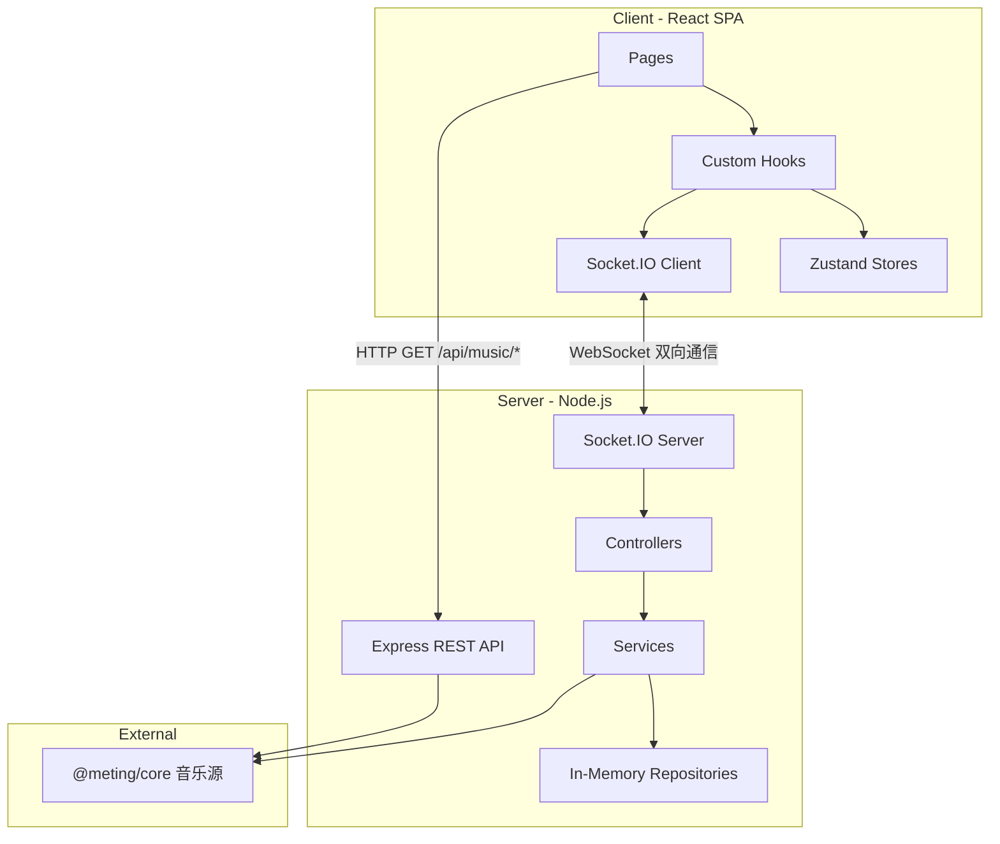

# Music Together — 项目速查手册

> 供 AI 助手快速理解项目全貌的参考文档。

## 1. 项目概览

**Music Together** 是一个在线同步听歌平台，允许多人在同一房间内实时同步播放音乐、聊天互动。

### 核心功能

| 功能 | 说明 |
|------|------|
| 房间系统 | 创建/加入房间，房间号邀请，可选密码保护 |
| 多音源搜索 | 网易云、QQ音乐、酷狗、酷我、百度 |
| 同步播放 | 房间内播放进度实时同步 |
| 实时聊天 | 房间内文字聊天 |
| 权限控制 | 房主模式 (`host-only`) / 协作模式 (`collaborative`) |
| 歌词展示 | Apple Music 风格歌词动画 (AMLL) |

### 技术栈

- **前端**: React 19 + Vite 7 + TypeScript 5.9 + Tailwind CSS v4 + shadcn/ui + Zustand
- **后端**: Node.js + Express 4 + Socket.IO 4 + @meting/core
- **Monorepo**: pnpm workspaces（3 个包：`client`、`server`、`shared`）

---

## 2. 目录结构

### 根目录

```
music-together/
├── packages/
│   ├── client/          # React 前端
│   ├── server/          # Node.js 后端
│   └── shared/          # 共享类型与常量
├── docs/                # 项目文档
├── .cursor/skills/      # Cursor IDE 技能配置
├── package.json         # 根 package（工作区编排）
├── pnpm-workspace.yaml  # pnpm 工作区定义
├── pnpm-lock.yaml
├── README.md
├── CLAUDE.md            # 本文件
├── .gitignore
└── .gitattributes
```

### packages/client/src/ — 前端源码

```
src/
├── main.tsx                    # 入口：ReactDOM.createRoot
├── App.tsx                     # 根组件：Router + Provider 嵌套
├── index.css                   # 全局样式：Tailwind + 主题变量 + 自定义动画
│
├── pages/                      # 页面级组件
│   ├── HomePage.tsx            #   大厅：创建/加入房间、房间列表
│   ├── RoomPage.tsx            #   房间：播放器 + 聊天（桌面侧栏/移动端 Drawer） + 覆盖层弹窗
│   └── NotFoundPage.tsx        #   404 页面
│
├── components/                 # UI 组件
│   ├── Chat/
│   │   ├── ChatMessage.tsx     #     单条消息（用户/系统）
│   │   └── ChatPanel.tsx       #     聊天面板（消息列表 + 输入框）
│   ├── Lobby/
│   │   ├── CreateRoomDialog.tsx #    创建房间弹窗
│   │   ├── NicknameDialog.tsx  #     设置昵称弹窗
│   │   ├── PasswordDialog.tsx  #     输入房间密码弹窗
│   │   ├── RoomCard.tsx        #     房间列表卡片
│   │   ├── UserPopover.tsx     #     用户信息气泡
│   │   ├── HeroSection.tsx     #     首页 Hero 标题区域
│   │   ├── ActionCards.tsx     #     创建/加入房间卡片
│   │   └── RoomListSection.tsx #     活跃房间列表区域
│   ├── Overlays/
│   │   ├── QueueDrawer.tsx     #     播放队列抽屉（vaul Drawer，移动端底部/桌面端右侧）
│   │   ├── SearchDialog.tsx    #     音乐搜索弹窗（壳）
│   │   ├── Search/
│   │   │   └── SearchResultItem.tsx # 搜索结果单项
│   │   ├── SettingsDialog.tsx  #     设置弹窗（壳）
│   │   └── Settings/
│   │       ├── SettingRow.tsx        # 设置行共享组件
│   │       ├── RoomSettingsSection.tsx
│   │       ├── LyricsSettingsSection.tsx
│   │       ├── ProfileSettingsSection.tsx
│   │       └── OtherSettingsSection.tsx
│   ├── Player/
│   │   ├── AudioPlayer.tsx     #     主播放器布局（封面+控件+歌词）
│   │   ├── LyricDisplay.tsx    #     AMLL 歌词渲染
│   │   ├── NowPlaying.tsx      #     当前曲目信息展示
│   │   └── PlayerControls.tsx  #     进度条+播放控制+音量
│   ├── Room/
│   │   └── RoomHeader.tsx      #     房间头部（房间名/人数/连接状态/操作按钮）
│   ├── InteractionGate.tsx     #   浏览器交互解锁（点击后才能播放音频）
│   └── ui/                     #   shadcn/ui 基础组件
│       ├── avatar.tsx
│       ├── badge.tsx
│       ├── button.tsx
│       ├── card.tsx
│       ├── dialog.tsx
│       ├── drawer.tsx
│       ├── dropdown-menu.tsx
│       ├── input.tsx
│       ├── label.tsx
│       ├── popover.tsx
│       ├── resize-handle.tsx
│       ├── scroll-area.tsx
│       ├── select.tsx
│       ├── separator.tsx
│       ├── responsive-dialog.tsx
│       ├── sheet.tsx
│       ├── skeleton.tsx
│       ├── slider.tsx
│       ├── switch.tsx
│       ├── tabs.tsx
│       └── tooltip.tsx
│
├── hooks/                      # 自定义 Hooks
│   ├── usePlayer.ts            #   播放器主 hook（组合 useHowl + useLyric + usePlayerSync）
│   ├── useHowl.ts              #   Howler.js 音频实例管理
│   ├── useLyric.ts             #   歌词加载与解析
│   ├── usePlayerSync.ts        #   播放进度同步（Socket 事件）
│   ├── useRoom.ts              #   房间状态管理（Socket 事件 ↔ Store）
│   ├── useChat.ts              #   聊天消息收发
│   ├── useLobby.ts             #   大厅房间列表与操作
│   ├── useQueue.ts             #   播放队列操作
│   └── useIsMobile.ts          #   视口宽度检测（匹配 Tailwind sm: 断点）
│
├── stores/                     # Zustand 状态仓库
│   ├── playerStore.ts          #   播放状态（currentTrack, isPlaying, volume 等）
│   ├── roomStore.ts            #   房间状态（room, currentUser, users）
│   ├── chatStore.ts            #   聊天（messages, unreadCount, isChatOpen）
│   ├── lobbyStore.ts           #   大厅（rooms 列表, isLoading）
│   └── settingsStore.ts        #   设置（移动端布局、歌词参数、背景参数，持久化到 localStorage）
│
├── providers/                  # React Context Provider
│   └── SocketProvider.tsx      #   Socket.IO 连接管理，提供 socket + isConnected
│
└── lib/                        # 工具库
    ├── config.ts               #   配置常量（SERVER_URL）
    ├── constants.ts            #   命名常量（定时器、阈值、布局尺寸）
    ├── resetStores.ts          #   全局 store 重置工具
    ├── socket.ts               #   Socket.IO 客户端实例
    ├── storage.ts              #   localStorage 封装（带类型校验）
    ├── format.ts               #   格式化工具（时间、文本等）
    ├── audioUnlock.ts          #   浏览器音频自动播放解锁
    └── utils.ts                #   cn() 等通用工具
```

### packages/server/src/ — 后端源码

```
src/
├── index.ts                    # 入口：Express + HTTP + Socket.IO 服务启动与优雅关闭
├── config.ts                   # 环境变量配置（PORT, CLIENT_URL, CORS, 时间常量）
│
├── controllers/                # 控制器：注册 Socket 事件处理器
│   ├── index.ts                #   统一注册入口
│   ├── roomController.ts       #   房间生命周期（创建/加入/离开/发现/设置）
│   ├── playerController.ts     #   播放控制（play/pause/seek/next/sync）
│   ├── queueController.ts      #   队列管理（add/remove/reorder）
│   └── chatController.ts       #   聊天消息
│
├── services/                   # 服务层：业务逻辑
│   ├── roomService.ts          #   房间 CRUD + 广播
│   ├── playerService.ts        #   播放状态管理 + 流 URL 解析
│   ├── queueService.ts         #   队列操作
│   ├── chatService.ts          #   聊天消息处理 + HTML 转义
│   ├── syncService.ts          #   周期性播放同步广播
│   └── musicProvider.ts        #   @meting/core 音乐数据聚合
│
├── repositories/               # 数据仓库：内存存储
│   ├── types.ts                #   接口定义（RoomRepository, ChatRepository）
│   ├── roomRepository.ts       #   房间数据 + Socket 映射（Map<string, RoomData>）
│   └── chatRepository.ts       #   聊天记录（Map<string, ChatMessage[]>）
│
├── middleware/                  # Socket.IO 中间件
│   ├── types.ts                #   TypedServer, TypedSocket, HandlerContext
│   ├── withRoom.ts             #   房间成员身份校验
│   └── withControl.ts          #   操作权限校验（包装 withRoom）
│
├── routes/                     # Express REST 路由
│   └── music.ts                #   GET /api/music/search|url|lyric|cover
│
├── types/
│   └── meting.d.ts             #   @meting/core 类型声明
│
└── utils/
    └── logger.ts               #   结构化日志（info/warn/error + JSON context）
```

### packages/shared/src/ — 共享代码

```
src/
├── index.ts           # 统一导出（re-export 所有模块）
├── types.ts           # 核心类型：Track, RoomState, PlayState, User, ChatMessage, RoomListItem
├── events.ts          # 事件常量：EVENTS 对象（room:*, player:*, queue:*, chat:*）
├── socket-types.ts    # Socket.IO 类型：ServerToClientEvents, ClientToServerEvents
└── constants.ts       # 业务常量：LIMITS（长度/数量限制）, TIMING（同步间隔/宽限期）
```

---

## 3. 架构与数据流

### 整体架构



### Socket 事件清单

| 分类 | 客户端 → 服务端 | 服务端 → 客户端 |
|------|-----------------|-----------------|
| **Room** | `room:create`, `room:join`, `room:leave`, `room:list`, `room:settings` | `room:created`, `room:state`, `room:user_joined`, `room:user_left`, `room:settings`, `room:error`, `room:list_update` |
| **Player** | `player:play`, `player:pause`, `player:seek`, `player:next`, `player:prev`, `player:sync`, `player:sync_request` | `player:play`, `player:pause`, `player:resume`, `player:seek`, `player:sync_response` |
| **Queue** | `queue:add`, `queue:remove`, `queue:reorder` | `queue:updated` |
| **Chat** | `chat:message` | `chat:message`, `chat:history` |

### 关键数据模型

```typescript
// 音乐曲目
interface Track {
  id: string; title: string; artist: string[]; album: string
  duration: number; cover: string
  source: 'netease' | 'tencent' | 'kugou' | 'kuwo' | 'baidu'
  sourceId: string; urlId: string
  lyricId?: string; picId?: string; streamUrl?: string
  requestedBy?: string  // 点歌人昵称
}

// 客户端可见的房间状态
interface RoomState {
  id: string; name: string; hostId: string
  mode: 'host-only' | 'collaborative'
  hasPassword: boolean; users: User[]; queue: Track[]
  currentTrack: Track | null; playState: PlayState
}

// 播放状态（含服务端时间戳用于同步校准）
interface PlayState {
  isPlaying: boolean; currentTime: number; serverTimestamp: number
}

// 用户
interface User { id: string; nickname: string; isHost: boolean }

// 聊天消息
interface ChatMessage {
  id: string; userId: string; nickname: string
  content: string; timestamp: number; type: 'user' | 'system'
}
```

### 播放同步机制

采用**周期广播 + 主动上报 + 网络延迟补偿**混合模式：

1. **周期广播**：`syncService` 每 5 秒 (`SYNC_BROADCAST_INTERVAL_MS`) 向有活跃播放的房间广播 `player:sync_response`，包含估算的 `currentTime` 和 `serverTimestamp`
2. **主动上报**：房主每 3 秒 (`HOST_REPORT_INTERVAL_MS`) 通过 `player:sync` 上报当前播放位置
3. **主动请求**：客户端每 30 秒 (`SYNC_REQUEST_INTERVAL_MS`) 发送 `player:sync_request` 作为兜底机制
4. **网络延迟补偿**：客户端收到同步数据后，利用 `serverTimestamp` 计算单程网络延迟并补偿到 `currentTime`（延迟限幅 `[0, 5s]` 防止时钟偏差）
5. **漂移校正**：客户端检测到本地播放位置与补偿后服务端位置偏差超过 0.5 秒 (`SYNC_DRIFT_THRESHOLD_S`) 时执行 seek 校正
6. **暂停快照**：服务端 `pauseTrack()` 在暂停前调用 `estimateCurrentTime()` 快照准确位置，确保 resume 从正确位置恢复
7. **恢复播放**：暂停后点击播放，服务端检测同一首歌时发 `player:resume`，客户端从暂停处继续（不创建新 Howl 实例）
8. **自动续播**：房主独自重新加入时，若有歌曲暂停/排队中，自动恢复播放
9. **加入房间补偿**：新加入/刷新/重连的客户端收到 `PLAYER_PLAY` 时，对 `currentTime > 0` 的中途加入场景执行网络延迟补偿（`currentTime === 0` 的新歌不补偿，避免触发 Howl 慢路径）
10. **宽限期**：房间空置 30 秒 (`ROOM_GRACE_PERIOD_MS`) 后自动清理
11. **切歌防抖**：500ms (`PLAYER_NEXT_DEBOUNCE_MS`) 内不重复触发下一首

### REST API

| 路径 | 方法 | 用途 |
|------|------|------|
| `/api/music/search` | GET | 搜索曲目（`source` + `keyword` + `page`） |
| `/api/music/url` | GET | 解析流媒体 URL（`source` + `id`） |
| `/api/music/lyric` | GET | 获取歌词 |
| `/api/music/cover` | GET | 获取封面图 |
| `/api/health` | GET | 健康检查 |

---

## 4. 第三方库依赖

### Client 核心依赖

| 分类 | 库 | 版本 | 用途 |
|------|----|------|------|
| **UI 框架** | react, react-dom | ^19.2.0 | UI 基础 |
| | shadcn/ui (new-york) | — | 组件库（基于 Radix UI） |
| | radix-ui | ^1.4.3 | 无障碍 UI 原语 |
| | tailwindcss | ^4.1.18 | 原子化 CSS |
| | class-variance-authority | ^0.7.1 | 组件变体样式 |
| | tailwind-merge | ^3.4.0 | class 合并去重 |
| | clsx | ^2.1.1 | 条件 class 拼接 |
| **状态管理** | zustand | ^5.0.11 | 轻量全局状态 |
| **路由** | react-router-dom | ^7.13.0 | 客户端路由 |
| **实时通信** | socket.io-client | ^4.8.3 | WebSocket 客户端 |
| **音频** | howler | ^2.2.4 | 音频播放引擎 |
| | @applemusic-like-lyrics/core | ^0.2.0 | 歌词解析核心 |
| | @applemusic-like-lyrics/react | ^0.2.0 | 歌词 React 组件 |
| **动画** | motion | ^12.34.0 | Framer Motion 动画 |
| | tw-animate-css | ^1.4.0 | Tailwind 动画预设 |
| **图形渲染** | @pixi/app, core, display, sprite | ^7.4.3 | PixiJS（歌词背景渲染） |
| | @pixi/filter-blur, filter-bulge-pinch, filter-color-matrix | — | PixiJS 滤镜 |
| **弹窗** | vaul | ^1.x | 移动端 Drawer（底部抽屉，支持拖拽关闭） |
| **工具** | dayjs | ^1.11.19 | 日期格式化 |
| | nanoid | ^5.1.6 | ID 生成 |
| | sonner | ^2.0.7 | Toast 通知 |
| | lucide-react | ^0.563.0 | 图标库 |
| | jss, jss-preset-default | ^10.10.0 | CSS-in-JS（AMLL 依赖） |

### Server 核心依赖

| 库 | 版本 | 用途 |
|----|------|------|
| express | ^4.21.0 | HTTP 框架 |
| socket.io | ^4.8.3 | WebSocket 服务端 |
| @meting/core | ^1.6.0 | 多音源音乐数据聚合 |
| nanoid | ^5.0.9 | 房间 ID 生成 |
| cors | ^2.8.5 | 跨域 |
| dotenv | ^16.4.5 | 环境变量 |

### 开发工具

| 库 | 版本 | 用途 |
|----|------|------|
| vite | ^7.3.1 | 前端构建 |
| @vitejs/plugin-react | ^5.1.1 | Vite React 插件 |
| @tailwindcss/vite | ^4.1.18 | Vite Tailwind 插件 |
| typescript | ~5.9.3 | 类型系统 |
| tsx | ^4.19.0 | 服务端 TS 运行/热重载 |
| eslint | ^9.39.1 | 代码检查 |
| eslint-plugin-react-hooks | ^7.0.1 | React Hooks 规则 |
| eslint-plugin-react-refresh | ^0.4.24 | React Fast Refresh 规则 |
| concurrently | ^9.2.1 | 并行运行前后端 |
| kill-port | ^2.0.1 | 端口清理 |

---

## 5. 设计模式

### 前端模式

#### Zustand Store 模式

5 个独立 store，各自管理一个领域的状态：

| Store | 职责 | 持久化 |
|-------|------|--------|
| `playerStore` | 播放状态（曲目、进度、音量、歌词） | 音量持久化到 localStorage |
| `roomStore` | 房间状态（room、currentUser、users） | 无 |
| `chatStore` | 聊天（消息列表、未读数、开关状态） | 无 |
| `lobbyStore` | 大厅（房间列表、加载状态） | 无 |
| `settingsStore` | 设置（移动端歌词位置、歌词对齐/动画、背景参数） | 全部持久化到 localStorage |

使用方式：通过选择器订阅特定字段，避免不必要的渲染：

```typescript
const volume = usePlayerStore((s) => s.volume)
```

在 Socket 回调中使用 `getState()` 避免闭包问题：

```typescript
const room = useRoomStore.getState().room
```

#### 自定义 Hooks 组合模式

`usePlayer` 是典型的组合 hook，内部编排多个子 hook：

```
usePlayer
├── useHowl          — Howler.js 实例管理（加载/播放/暂停/seek）
├── useLyric         — 歌词加载、LRC 解析
└── usePlayerSync    — Socket 播放同步事件收发
```

其他独立 hook：`useRoom`、`useChat`、`useLobby`、`useQueue`，每个 hook 负责将 Socket 事件绑定到对应 Store。

#### 受控 Dialog 模式

所有弹窗组件遵循统一的 prop 接口：

```typescript
interface DialogProps {
  open: boolean
  onOpenChange: (open: boolean) => void
  // 业务回调...
}
```

父组件（页面）管理 `open` 状态，弹窗组件只负责渲染和用户交互。

#### ResponsiveDialog 模式

`responsive-dialog.tsx` 通用组件根据视口宽度自动切换呈现方式：

- **桌面端**（≥640px）：居中 Dialog（基于 Radix UI）
- **移动端**（<640px）：底部 Drawer（基于 vaul，支持拖拽关闭）

通过 React Context 向子组件传递 `isMobile` 状态，提供一一映射的子组件：`ResponsiveDialog`、`ResponsiveDialogContent`、`ResponsiveDialogHeader`、`ResponsiveDialogTitle`、`ResponsiveDialogDescription`、`ResponsiveDialogFooter`、`ResponsiveDialogClose`、`ResponsiveDialogBody`。使用方只需替换 import 路径即可获得响应式行为。项目中所有业务弹窗（CreateRoomDialog、PasswordDialog、NicknameDialog、SearchDialog、SettingsDialog）均已迁移至此组件。

#### Context Provider 模式

`SocketProvider` 通过 React Context 提供 Socket.IO 实例和连接状态：

```typescript
const { socket, isConnected } = useSocketContext()
```

#### 组件组合模式

`AudioPlayer` 组合 `NowPlaying` + `PlayerControls` + `LyricDisplay`，各组件独立负责自己的渲染逻辑。`RoomPage` 组合所有功能区域和覆盖层弹窗。

### 后端模式

#### 分层架构

```
Controller → Service → Repository
```

- **Controller**：注册 Socket 事件监听器，调用 Service
- **Service**：业务逻辑、跨领域编排、Socket 广播
- **Repository**：数据存取（当前为内存 Map，接口抽象，可替换为数据库）

#### Repository 模式

使用 TypeScript 接口抽象数据访问：

```typescript
interface RoomRepository {
  get(roomId: string): RoomData | undefined
  set(roomId: string, room: RoomData): void
  delete(roomId: string): void
  getAll(): Map<string, RoomData>
  // ...
}
```

当前实现为 `InMemoryRoomRepository`（`Map<string, RoomData>`），未来可替换为 Redis/数据库实现。

#### Socket.IO 中间件链

```
withControl(io)  →  withRoom(io)  →  Handler
```

- `withRoom`：校验 Socket 是否在房间中，构建 `HandlerContext`（io, socket, roomId, room, user）
- `withControl`：在 `withRoom` 基础上增加操作权限检查（`host-only` 模式下仅房主可操作）

错误统一通过 `ROOM_ERROR` 事件回传给客户端，错误码包括：`NOT_IN_ROOM`、`ROOM_NOT_FOUND`、`NO_PERMISSION`、`INVALID_DATA`、`QUEUE_FULL`、`INTERNAL` 等。

#### 结构化日志

```typescript
logger.info('Room created', { roomId, socketId: socket.id })
logger.error('Failed to resolve stream URL', err, { roomId, trackId })
```

输出格式：`[ISO_TIMESTAMP] LEVEL message {JSON_CONTEXT}`

### 共享模式

#### 类型驱动的事件系统

`EVENTS` 常量对象定义所有事件名，`ClientToServerEvents` / `ServerToClientEvents` 接口为每个事件定义精确的负载类型，确保前后端通信的类型安全。

#### 常量集中管理

`LIMITS` 和 `TIMING` 在 shared 包中统一定义，前后端共用：

```typescript
LIMITS.QUEUE_MAX_SIZE       // 100
LIMITS.CHAT_HISTORY_MAX     // 200
TIMING.SYNC_BROADCAST_INTERVAL_MS  // 10_000
TIMING.ROOM_GRACE_PERIOD_MS        // 30_000
```

---

## 6. 代码规范

### 语言与模块

- **TypeScript strict 模式**：所有包均启用 `"strict": true`
- **ESM**：所有包 `"type": "module"`，使用 `import/export` 语法
- **目标**：ES2022（server/shared），ES2022 + DOM（client）
- **模块解析**：`"moduleResolution": "bundler"`

### 命名规范

| 类型 | 规范 | 示例 |
|------|------|------|
| 组件文件/组件名 | PascalCase | `ChatPanel.tsx`, `AudioPlayer` |
| Hook 文件/函数名 | camelCase + `use` 前缀 | `usePlayer.ts`, `useHowl` |
| Store 文件 | camelCase + `Store` 后缀 | `playerStore.ts` |
| 工具函数/文件 | camelCase | `format.ts`, `formatDuration()` |
| 类型/接口 | PascalCase | `Track`, `RoomState`, `HandlerContext` |
| 常量 | UPPER_SNAKE_CASE | `EVENTS`, `LIMITS`, `TIMING` |
| 事件名 | 命名空间:动作 | `room:create`, `player:sync_response` |

### 路径别名

客户端使用 `@/*` 映射到 `src/*`：

```typescript
import { usePlayerStore } from '@/stores/playerStore'
import { cn } from '@/lib/utils'
```

### 状态更新

Zustand Store 通过 `set()` 进行不可变更新：

```typescript
// 展开运算符更新嵌套状态
updateRoom: (partial) =>
  set((state) => ({
    room: state.room ? { ...state.room, ...partial } : null,
  }))
```

### 错误处理

- **REST 路由**：每个 handler 使用 `try/catch`，返回适当的 HTTP 状态码
- **Socket.IO**：中间件统一捕获异步错误，通过 `ROOM_ERROR` 事件回传错误码和消息
- **客户端**：hook 中处理 Socket 错误事件，使用 `sonner` toast 提示用户

### ESLint 配置

- **Flat config** 格式（`eslint.config.js`）
- 仅客户端包配置了 ESLint
- 插件：`@eslint/js` recommended + `typescript-eslint` recommended + `react-hooks` + `react-refresh`
- 无 Prettier（依赖编辑器格式化）

### 导入顺序（约定）

```typescript
// 1. 第三方库
import { create } from 'zustand'
import type { Track } from '@music-together/shared'

// 2. 内部模块（@/ 别名）
import { storage } from '@/lib/storage'
import { usePlayerStore } from '@/stores/playerStore'
```

---

## 7. UI 设计规范

### 组件库

- **shadcn/ui**：`new-york` 风格变体，`neutral` 基色
- **配置**：非 RSC（`"rsc": false`），使用 CSS 变量，Lucide 图标
- **安装路径**：`@/components/ui/`，工具函数 `@/lib/utils`

### 颜色系统

使用 **oklch 色彩空间**，通过 CSS 变量定义亮/暗两套主题：

```css
:root {
  --background: oklch(1 0 0);          /* 纯白 */
  --foreground: oklch(0.145 0 0);      /* 近黑 */
  --primary: oklch(0.205 0 0);         /* 深色主色 */
  /* ... */
}

.dark {
  --background: oklch(0.178 0.005 265); /* 深蓝灰 */
  --foreground: oklch(0.985 0 0);       /* 近白 */
  --primary: oklch(0.922 0 0);          /* 亮色主色 */
  --card: oklch(0.235 0.008 265);       /* 微蓝灰卡片 */
  --accent: oklch(0.35 0.008 265);      /* 强调色 */
  /* ... */
}
```

暗色模式使用 `.dark` CSS 类切换，Tailwind v4 通过 `@custom-variant dark (&:is(.dark *))` 支持。

### 字体

- **主字体**：Plus Jakarta Sans（通过 `<link>` 在 `index.html` 加载）
- **回退**：system-ui, -apple-system, sans-serif

### 圆角

基准值 `--radius: 0.625rem`，其他圆角通过计算派生：

```css
--radius-sm: calc(var(--radius) - 4px);   /* 小 */
--radius-md: calc(var(--radius) - 2px);   /* 中 */
--radius-lg: var(--radius);               /* 标准 */
--radius-xl: calc(var(--radius) + 4px);   /* 大 */
```

### 图标

使用 **lucide-react**，按需导入：

```typescript
import { Play, Pause, SkipForward, Volume2 } from 'lucide-react'
```

### 动画

- **motion (Framer Motion)**：组件进入/退出动画、列表动画
- **tw-animate-css**：Tailwind 动画预设类
- **自定义动画**：`float` 关键帧（6s 缓动上下浮动）

```css
@keyframes float {
  0%, 100% { transform: translateY(0); }
  50% { transform: translateY(-6px); }
}
```

### 滚动条

自定义 WebKit 滚动条：6px 宽，透明轨道，半透明滑块。

### 歌词渲染

- **AMLL** (`@applemusic-like-lyrics/react`)：Apple Music 风格逐行歌词动画
- **PixiJS 背景**：`BackgroundRender` 组件使用 PixiJS 渲染动态专辑封面背景
- 歌词设置可调：对齐锚点、弹簧动画、模糊效果、缩放效果、字重

### 样式工具函数

```typescript
// cn() — 条件 class 合并（clsx + tailwind-merge）
import { cn } from '@/lib/utils'

<div className={cn('base-class', isActive && 'active-class')} />
```

### Toast 通知

使用 **sonner**，定位在顶部居中：

```typescript
<Toaster position="top-center" richColors />
```

---

## 8. 开发指南

### 快速启动

```bash
# 安装依赖
pnpm install

# 启动前后端开发服务器
pnpm dev

# 仅启动前端
pnpm dev:client

# 仅启动后端
pnpm dev:server
```

### 端口

| 服务 | 默认端口 |
|------|---------|
| 前端 (Vite) | 5173 |
| 后端 (Express + Socket.IO) | 3001 |

### 环境变量

#### 服务端 (`packages/server/.env`)

| 变量 | 说明 | 默认值 |
|------|------|--------|
| `PORT` | 服务端口 | `3001` |
| `CLIENT_URL` | 客户端地址（CORS） | `http://localhost:5173` |
| `CORS_ORIGINS` | 额外 CORS 源（逗号分隔） | 空 |

#### 客户端 (Vite 环境变量)

| 变量 | 说明 | 默认值 |
|------|------|--------|
| `VITE_SERVER_URL` | 后端地址 | `http://localhost:3001` |

### 构建

```bash
# 构建所有包
pnpm build

# 前端产物 → packages/client/dist/
# 后端产物 → packages/server/dist/
# shared 包无构建步骤，直接作为 TS 源码引用
```

### 添加 shadcn/ui 组件

```bash
cd packages/client
npx shadcn@latest add <component-name>
```

组件会安装到 `src/components/ui/`。

### 注意事项

- 服务端数据全部存储在内存中，重启后丢失
- 无数据库、无持久化、无用户认证系统
- 用户身份基于 Socket ID + 昵称
- `shared` 包修改后前后端会自动热重载（pnpm workspace 链接）
